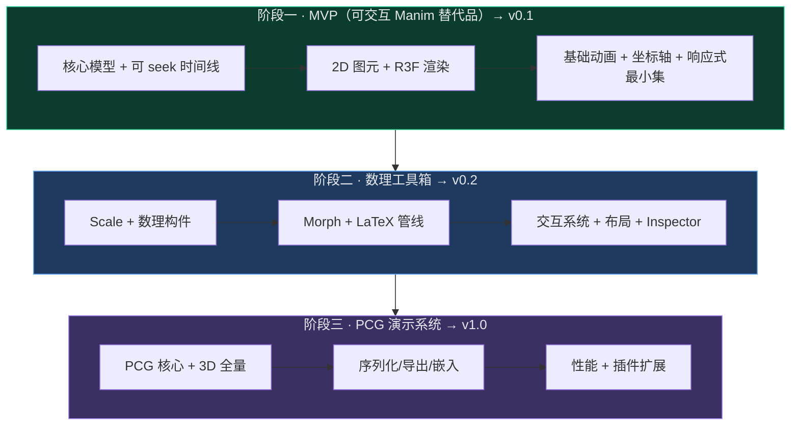
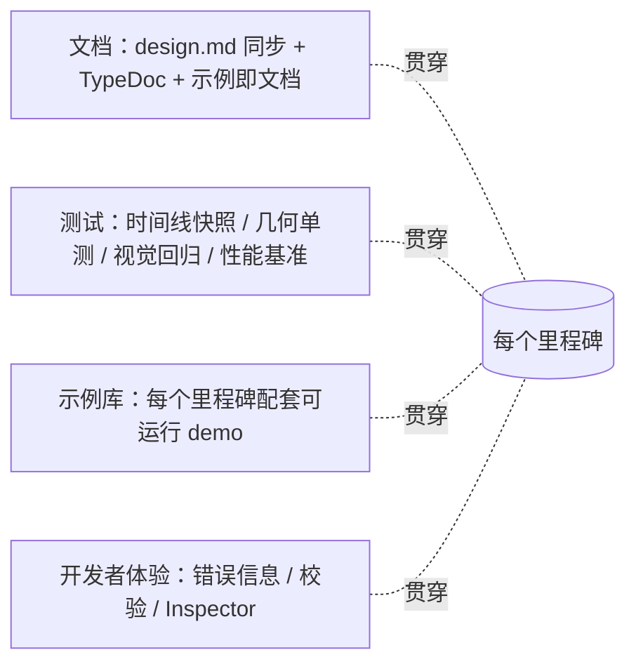

# Intermact 开发里程碑图谱

本文件是 Intermact 的开发路线图，描述从"可交互 Manim 替代品"到"面向数理可视化的 PCG 演示与交互系统"的里程碑划分、依赖关系、相对排期与验收标准。它与 `design.md` 配套：架构/接口的"是什么"在 `design.md`，交付节奏的"何时/按何顺序"在本文件。

> 排期以**相对周（W）**与示意日期表达，用于刻画**顺序与时长占比**，非交付承诺。新里程碑/调整请并入本文件，不要新建独立 md。

## 0. 如何阅读

- **阶段（Phase）**：对应 `design.md §1.1` 的三层同心圆愿景，每层自成一个可发布的能力闭环。
- **里程碑（Milestone, M*）**：阶段内可独立验收的交付单元，含明确的**退出标准（Exit Criteria）**。
- **里程碑节点（◆）**：阶段验收/版本发布点。
- 每个里程碑都标注其对应的 `design.md` 章节，便于查证设计意图。

| 标记 | 含义 |
| --- | --- |
| `crit` | 关键路径，阻塞后续多数工作 |
| `◆` | 阶段闸口 / 版本发布 |
| DoD | Definition of Done，完成定义 |

## 1. 总览：三层愿景 → 三个阶段

每层在前一层之上扩展，且不破坏前一层接口契约（`design.md §1.1`）。每层结束都产出**可发布版本 + 可运行示例集**。

## 2. 里程碑依赖图谱
这是路线图的核心——里程碑之间的依赖 DAG。箭头表示"被依赖 → 依赖方"。关键路径以粗体语义标注（`crit`）。

**关键路径**：`M0 → M1 → M2 → M3 → … → M16 → v1.0`。其中 **M1（可 seek 时间线 + Player）是全局基石**——它决定了确定性、可重放、导出、回归测试能否成立（`design.md §3.2`），必须最先达到稳定。

## 3. 相对排期甘特图

下图表达里程碑的**顺序、并行关系与时长占比**。日期为示意（锚定 W1 为项目启动周），并行轨道反映可由不同人/小组同时推进的工作。

> 总跨度约 **8–10 个月**（单一小团队、串行关键路径）。若在阶段二/三投入并行人力（渲染、数理、PCG 分线），可压缩至约 6–7 个月。

## 4. 阶段一 · MVP（v0.1）

**阶段目标**：跑通"声明对象 → 注册场景 → 构建可 seek 时间线 → 实时渲染 → 拖动进度条/调参"的最小闭环，复刻 Manim 基础体验且具备 Web 交互雏形。

### 4.0 Phase-1 完成状态（2026-06-06）

| 里程碑 | 状态 | 示例交付 | CI / 测试 |
| --- | --- | --- | --- |
| M0 工程基座 | ✅ 已完成 | `_template/empty-canvas`、`_smoke/static-circle` | depcruise + build |
| M1 核心模型/时间线/Player | ✅ 已完成 | `timeline/*`（3） | 快照测试纳入 `pnpm run test` |
| M2 2D 几何与采样 | ✅ 已完成 | `geometry/*`（2） | 几何单测 12+ 项 |
| M3 R3F 渲染适配 | ✅ 已完成 | `render/*`（3） | `scene-view` smoke |
| M4 基础动画 | ✅ 已完成 | `anim/*`（3） | `animations.test.ts` |
| M5 坐标系与轴 | ✅ 已完成 | `coords/*`（3）；API：`getAxes` | `coordinate-transform` 单测 |
| M6 响应式最小集 | ✅ 已完成 | `reactive/*`（2） | `reactive.test.ts` |
| ◆ L1 v0.1 验收 | ✅ 已完成 | `l1/basic-2d`、`l1/interactive-sine` | `pnpm run ci` 全绿（67 tests） |

**文档**：Phase-1 使用者文档已落地为 VitePress 站点（`docs/`，`pnpm run dev:docs`），覆盖指南、**API Reference**（TypeDoc 从 `packages/*/src` TSDoc 生成至 `docs/reference/`）、示例索引与 v0.1 验收清单；架构契约仍以本仓库 `design.md` 为准。

**与设计稿的主要偏差**（详见 `design.md §0.1`）：arc-length morph 作 L1 兜底（完整 matching→M9）；`getAxes` 取代 `showAxes/hideAxes`；`decimalNumber` 示例用 `xy` 非 `uv` HUD。

**评审与清偿**（2026-06-08）：Phase-1 系统性代码评审、已解决问题与关键决策见 [`phase-1-review.md` §11.10](./phase-1-review.md#1110-清偿记录与决策摘要2026-06-08)（含 P0–P2 清偿状态与 Phase-2 入口待办）。

**下一阶段**：Phase-2（v0.2 数理工具箱）已于 2026-06 完成（M7–M12 全部 ✅，详见 §5.0 与 `design.md §0.2`）。下一步进入 Phase-3 **M13 PCG 核心**（§6），关键路径 `M12 → M13`。

### M0 · 工程基座 `crit` ✅

> **状态**：已完成（2026-06）。

- **目标**：建立 monorepo、构建链、测试与 CI，落地 `design.md §3.4` 的包边界与 `§3.1` 的依赖规则。
- **依赖**：无。
- **交付物**：
  - monorepo（`core` / `render-three` / `render-r3f` / `react` / `examples`）与 TS 严格模式配置。
  - 构建（Vite/tsup）、单测（Vitest）、lint/format、CI 流水线。
  - 依赖规则校验（如 `dependency-cruiser`）：禁止 `core` 引入 React/three/DOM。
- **退出标准**：CI 绿；一条空示例可启动并渲染空白 Canvas；依赖规则校验生效并阻断违规 import。
- **风险**：低。
- **Examples（目标交付）**：
  - `examples/_template/empty-canvas` — 最小空 Canvas 模板，验证启动、热更新、构建产物。
  - `examples/_smoke/static-circle` — 仅渲染一个静态圆的烟雾测试（不依赖时间线/动画），作为 CI 冒烟用例。

### M1 · 核心模型 / 时间线 / Player `crit` ✅

> **状态**：已完成（2026-06）。

- **目标**：实现不可变对象模型、trait/capability、不可变 RuntimeState，以及**保留模 Storyboard + 可 seek Player**（`design.md §3.2、§4、§11.1、§11.3`）。
- **依赖**：M0。
- **交付物**：
  - `IMObject`/`ObjectTrait`/`RuntimeState`/`StatePatch` 类型与不可变 store。
  - `Storyboard`/`Track`/`AnimationSpec` 与"构建期累积、播放期求值"的双阶段执行（`§3.2`）。
  - `Player`：`play/pause/seek/setRate/setLoop/jumpToMarker`，纯函数 `Track.evaluate`。
  - 无头运行能力（Node/Worker 中可构建 Storyboard 并按 t 求值）。
- **退出标准**：给定一段构建期程序，可在任意 `t` 确定性求值得到一致 RuntimeState；`seek` 前后帧一致；时间线快照测试通过。
- **风险**：高（架构基石）。**缓解**：先做最小可 seek 原型（仅 tween）打通，再扩展动画种类。
- **Examples（目标交付）**：
  - `examples/timeline/seek-basics` — 单个 tween 的进度条 seek / 变速 / 反向，直观验证可 seek 与确定性。
  - `examples/timeline/headless-eval` — 在 Node 中无头构建 Storyboard 并对采样 `t` 打印 RuntimeState，作为确定性快照基线。
  - `examples/timeline/markers-slides` — 用 `marker` 做幻灯片式跳章（`jumpToMarker`）。

### M2 · 2D 几何与采样 `crit` ✅

> **状态**：已完成（2026-06）。

- **目标**：2D 图元工厂与几何采样（`design.md §5`）。
- **依赖**：M1。
- **交付物**：Circle/Ellipse/Rectangle/Arc/Polygon/BezierCurve/Line/Arrow；弧长重采样、`SampledPath2D`、`Float32Array` 缓冲通道、earcut 三角化、`getBounds`。
- **退出标准**：各图元采样点数/弧长/bounds 单测通过；闭合与带洞图形三角化正确；缓冲通道与元组通道结果一致。
- **风险**：中（三角化/带洞边界用例）。
- **Examples（目标交付）**：
  - `examples/geometry/primitives-gallery` — 全部 2D 图元一览（含带洞多边形、复合贝塞尔）。
  - `examples/geometry/sampling-debug` — 可视化弧长采样点、bounds 与三角化网格，辅助调试。

### M3 · R3F 渲染适配 `crit` ✅

> **状态**：已完成（2026-06）。

- **目标**：把 RenderSnapshot 映射到 R3F/Three，落地渲染管线难点（`design.md §15`）。
- **依赖**：M2。
- **交付物**：
  - stroke（含 trim/恒定屏幕宽度选项）、fill（earcut + fillRule）、basic material。
  - `IntermactCanvas`、`Viewport`、z 序/透明处理、DPI/resize + `fit` 策略。
  - `SceneRendererAdapter` 接口与 diff 更新。
- **退出标准**：基础对象在浏览器正确渲染；resize/HiDPI 不失真；stroke trim 随 reveal 平滑；renderer smoke test 不抛错。
- **风险**：中高（WebGL 细线/透明/拾取细节）。
- **Examples（目标交付）**：
  - `examples/render/stroke-fill-showcase` — stroke trim + 各 `fillRule` + 世界单位/像素线宽对照。
  - `examples/render/zorder-transparency` — z 序与半透明排序边界用例。
  - `examples/render/dpi-resize` — HiDPI 与容器 resize 下 `fit` 策略不失真。

### M4 · 基础动画（数据 + 解释器） ✅

> **状态**：已完成（2026-06）。

- **目标**：Create/Fade/Move/Rotate/Scale/Tween，全部以 `AnimationSpec` 表达并编译为 Track（`design.md §11`）。
- **依赖**：M1、M2。
- **交付物**：动画工厂、`sequence/parallel/stagger/wait/call`、easing 库、Create 的描边/填充 reveal 策略。
- **退出标准**：组合动画可 seek；Create 在 play 前不显示；`call` 被标注为不可 seek 边界并在拖拽预览时告警。
- **风险**：中。
- **Examples（目标交付）**：
  - `examples/anim/create-fade-move` — Create/Fade/Move/Rotate/Scale 动画画廊。
  - `examples/anim/sequence-parallel-stagger` — 串行/并行/错峰（stagger）编排对照。
  - `examples/anim/easing-gallery` — 各 easing 曲线效果对照。

### M5 · 坐标系与轴 ✅

> **状态**：已完成（2026-06）。轴 API 为 `Scene.getAxes(props)`（见 `design.md §0.1` v0.1.1 修订）。

- **目标**：cartesian 2D 坐标系、abs/rel/fit 转换、`getAxes` + RegisteredObject 动画（`design.md §7.2、§9.1`）。
- **依赖**：M2、M4。
- **交付物**：`CoordinateTransform2D`、域/视口/纵横比策略、轴淡入淡出动画。
- **退出标准**：abs↔rel 往返一致；不同 `fit` 下布局正确；轴可动画显隐。
- **风险**：低。
- **Examples（目标交付）**：
  - `examples/coords/cartesian-axes` — `getAxes` + `fadeIn`/`fadeOut` 淡入淡出。
  - `examples/coords/fit-strategies` — contain/cover/stretch 与 abs↔rel 往返可视化。
  - `examples/coords/polar-scene` — 极坐标场景与定位。

### M6 · 响应式最小集 ✅

> **状态**：已完成（2026-06）。

- **目标**：`signal/computed/valueTracker` + `derived/addUpdater`（`design.md §8`）。
- **依赖**：M1。
- **交付物**：依赖追踪、最小重算、updater 卸载、`tweenSignal`。
- **退出标准**：信号变化仅重算受影响对象；依赖图无遗漏/冗余；与时间线协同（tween 一个 tracker 驱动 derived）。
- **风险**：中。
- **Examples（目标交付）**：
  - `examples/reactive/value-tracker` — `tweenSignal` 驱动 `derived`（双曲线内接矩形，对应 `design.md §8.2`）。
  - `examples/reactive/leva-binding` — Leva 参数绑定信号、只更新参数不重建 program（`design.md §19.2` 精简版）。

### ◆ v0.1 验收（DoD） ✅

> **状态**：已完成（2026-06）。在线验收清单：`docs/project/v01-checklist.md`。

- [x] 可运行示例：基础 2D（Create/Move/Tween）+ 交互函数曲线（拖 Leva 调参，曲线实时重算）。
- [x] 进度条可拖动 seek，结果确定；时间线快照测试纳入 CI。
- [x] `design.md §19.1、§19.2` 示例可跑通（`l1/basic-2d`、`l1/interactive-sine`）。
- [x] `pnpm run ci` 全绿（lint + typecheck + 67 vitest + depcruise + build）。
- [x] Phase-1 使用者文档（VitePress `docs/`）已发布初版。

## 5. 阶段二 · 数理工具箱（v0.2）

**阶段目标**：在 MVP 之上提供数理可视化刚需构件与公式动画能力，达到"能讲清一节微积分/线性代数"的表达力，并让交互探索成为一等能力。

### 5.0 Phase-2 进度

| 里程碑 | 状态 | 示例交付 | 测试 |
| --- | --- | --- | --- |
| M7 Scale 与刻度 | ✅ 已完成 | `scale/*`（2） | `scale.test.ts`（12 项） |
| M8 数理构件库 | ✅ 已完成 | `math/*`（5） | `constructs.test.ts`（14 项） |
| M9 Morph（含分部匹配） | ✅ 已完成 | `morph/*`（3） | `morph-strategies.test.ts`（8 项） |
| M10 Text / LaTeX 管线 | ✅ 已完成 | `text/*`、`latex/*`（3） | `text.test.ts`（11 项） |
| M11 交互系统 | ✅ 已完成 | `interaction/*`（3） | `interaction.test.ts`（6+3 项） |
| M12 布局 + Inspector | ✅ 已完成 | `layout/*`、`devtools/*`（3） | `layout.test.ts`（11 项） |
| ◆ L2 v0.2 验收 | ✅ 已完成 | 见 §「◆ v0.2 验收（DoD）」 | `pnpm run ci` 全绿（152 tests） |

**评审与清偿**（2026-06-09）：Phase-2 系统性代码评审、已解决问题与仍开放项见 [`phase-2-review.md` §12](./phase-2-review.md#12-phase-2-代码评审code-review--2026-06-09)（P0–P2 门禁/正确性项已清偿；**MorphAnchor**、布局语义、P3 打磨项见 §5.1）。

**验收后缺陷修复 / 打磨（2026-06-08，示例联调）**：详见 `design.md §0.2`「Phase-2 验收后缺陷修复 / 打磨」。摘要：
- **Examples 卡 "Building…"**：`@intermact/core` 在示例 dev server 被双实例加载（`src` 与 `dist` 各一份）致响应式 signal 注册表（模块级 `WeakMap`）不互通 → `examples/vite.config.ts` 增 `resolve.alias` 锁定单一 `src` 实例；`useIntermactPlayer` 对构建失败 `.catch` 报错而非静默。
- **Morph 无动画**：morph 每帧改 `geometryOverride` 但不动 `geometryVersion`，而渲染器仅按版本号重建几何 → `animation/track.ts` 写入随进度变化的 `geometryVersion`；`group2D` 须显式顶层 `style`（修 `matching-shapes` 黑屏）；新增 `Caption` 组件为各 demo 加说明。
- **Text/LaTeX 笔触粗细不一**：改为常量笔宽**轮廓字形**（新增 `geometry/stroke-outline.ts`），支持实心/空心/描边填充三态与勾线色/填充色分离；重写 `triangulate` 以正确处理多个不相连带洞字形；`appendRibbon` 加 miter join + 圆头帽统一描边宽度。

### 5.1 Phase-2 评审后待办（未实现 / 推迟）

> 来源：[`phase-2-review.md` §12.10–§12.12](./phase-2-review.md#1210-建议清偿优先级进入-phase-3-前)。**不影响 v0.2 闸口结论**（M7–M12 功能已验收），下列为 v0.2.x 补丁或 Phase-3 入口前应处理的债。

| 项 | 严重度 | 现状 | 建议归属 | 说明 |
| --- | --- | --- | --- | --- |
| **`MorphAnchor` / `morphAnchors()`** | 中 | ⏳ 仅 `traits.ts` 声明；morph 管线不读取 | **M9 增量** 或 v0.2.x | 与已实现的 **`anchor` 策略**（自动最优旋转/反向）不同——见下节「为何不实现 MorphAnchor」 |
| **`LayoutHandle` 急切提交 vs 动画语义** | 中 | ⏳ `fitTo`/`alignTo` 构建期 `setTransform` 与 `initialStates` 插值并存 | **设计稿 §9 固化** → M15 前 | 需在 `design.md §9.4` 二选一语义后再改实现 |
| **`logScale` 负域 / symlog** | 低 | ⏳ 仅严格正域 | v0.2.x 或 M8 增量 | 设计稿曾提及负域；实现与文档需对齐 |
| **`logScale` 非 base-10 子刻度** | 低 | ⏳ minor ticks 仅 base 10 | v0.2.x | 其他底数刻度偏稀 |
| **`timeScale.tickFormat` 分辨率** | 低 | ⏳ 按总 span 而非 tick 步长 | v0.2.x | 标签格式可能与刻度间隔错配 |
| **M8 轴/矩阵标签空心字** | 低/视觉 | ⏳ `strokeObject` + `labelContours` | v0.2.x | 刻度文字为描边轮廓；可改 per-glyph fill |
| **MathJax `extractMathJaxPaths` flipY 继承** | 中 | ⏳ 嵌套 `<g>` 翻转状态未严格累积 | v0.2.x | 复杂 TeX 布局可能脆弱 |
| **`invalid-argument` 错误码** | 低/文档 | ⏳ 代码有、§16 码表无 | 文档同步 | 与 `setParent` 校验等新抛错一致 |
| **Phase-1 遗留**（easing/react/SceneView 单测、视觉回归、Player 裁剪等） | 中 | ⏳ | **M16** | 见 [`phase-1-review.md` §11.10.3](./phase-1-review.md#11103-仍开放--推迟项phase-2-入口参考) |

#### 为何不实现 `MorphAnchor`（评审结论）

设计稿 §11.4 将两类能力写在同一段，易混淆：

1. **`MorphStrategy: "anchor"`（✅ 已实现）** — 算法自动对齐：闭合轮廓做**最优循环旋转**（`rotateAlignClosed`），开放轮廓在正向/反向采样间选 MSE 更小者（`anchorAlign`）。无需用户输入，Phase-2 示例 `morph/shape-morph` 已覆盖。
2. **`MorphAnchor` / `MorphableTrait.morphAnchors()`（⏳ 未实现）** — **用户显式锚点对** `{ source: AbsXY, target: AbsXY }`，用于在自动配对失败时「钉住」特征点（如「这个角必须落到那个角」）。Phase-2 未做是因为：
   - **M9 DoD 已被四策略 + matching 满足**：教学场景优先 LaTeX 分部匹配与 arc-length/自动 anchor，无 demo 依赖显式锚点；
   - **管线未接通**：无任何图元/构件实现 `morphAnchors()`，`buildMorphFrames` / `buildMatchingFrames` 也不读取该 trait；
   - **API 未定型**：锚点是 per-object、per-contour 还是 per-part；最少需要几对点才能约束对齐；与 `matching` 的 part key 如何组合——需在 M9 增量或 v0.2.x 单独立项设计后再实现。

**决策**：保留 `MorphAnchor` 类型作前向兼容占位，**实现推迟至 M9 增量**（或 v0.2.x patch），不在 Phase-3 关键路径上阻塞 M13。

### M7 · Scale 与刻度 ✅

> **状态**：已完成（2026-06）。`Scale` 落地于 `packages/core/src/math/scale.ts`。

- **目标**：linear/log/pow/time Scale + ticks/format（`design.md §7.3`）。
- **依赖**：v0.1（L1）。
- **交付物**：`Scale` 接口与四类实现、`ticks`、`tickFormat`、`invert`；附带 `numericTicks`/`tickStep`/`timeTicks` 工具（供 M8 轴刻度复用）。
- **退出标准**：各 Scale 正反映射与刻度单测通过；log 边界、time 跨度用例正确。**已满足**（`scale.test.ts` 12 项全绿）。
- **与设计稿对齐**：接口签名与 `design.md §7.3` 一致；刻度用 D3 nice-number 算法；`timeScale` 刻度按 UTC 日历对齐。**偏差**：`tickFormat` 的 `spec` 仅支持最小子集（`"%"`、`".<n>f"`），完整 D3 format mini-language未实现（按需在 M8/M10 扩展）。**评审后仍开放**（§5.1）：log 负域、非 base-10 子刻度、`timeScale.tickFormat` 分辨率。
- **风险**：低。
- **Examples（目标交付）**：
  - `examples/scale/scale-playground` — linear/log/pow/time 对照与 ticks/format 交互。
  - `examples/scale/log-plot` — 对数坐标作图与刻度格式化。

### M8 · 数理构件库 ✅

> **状态**：已完成（2026-06）。构件落地于 `packages/core/src/constructs/*`（依附图形/planes/number-line/matrix/table/brace），轴升级在 `layout/axes.ts`，标签经 M10 `labelContours`/`glyphText`。

- **目标**：NumberLine/Axes/NumberPlane/PolarPlane/ComplexPlane、FunctionGraph/Parametric/Area/Riemann/Tangent、Matrix/Table/Brace/DecimalNumber（`design.md §7.4`）。
- **依赖**：M5、M7。
- **交付物**：构件工厂（`constructs/`）、基于 `Scale` 重写的 `axesObject`（刻度/数字标签）、`AxesHandle` 暴露 `xScale/yScale`、依附构件经 `c2p` 定位、复用 `seven-segment` 字形的 `decimalNumber`/标签、`shapeObject`/`strokeObject` 共享构造器。
- **退出标准**：FunctionGraph/Riemann/Tangent 通过 `c2p` 正确贴合；DecimalNumber 随信号刷新；Matrix/Table 布局正确。**已满足**（`constructs.test.ts` 14 项全绿：c2p 贴合/反投影、Riemann 收敛、切线斜率、planes 线数、matrix/table/brace bounds）。
- **与设计稿对齐**：构件签名与 `design.md §7.4` 一致；坐标系/依附构件按 `ax.handle` 模式扩展。**偏差/具体化**：① `brace(target, direction, opts)` 接受 `Bounds2D | IMObject2D` 而非 `RegisteredObject2D`，以保持 `constructs` 不依赖 scene 层；② 数字标签已升级 OpenType/`labelContours`（M10）；无默认字体时标签降级为空轮廓（2026-06-09）；③ 构件归于 `packages/core/src/constructs/`。**评审后仍开放**（§5.1）：轴/矩阵/表格标签仍为 stroke 空心字；`functionGraph` 非有限值分段已于 2026-06-09 落地。
- **风险**：中。**已落地**。
- **Examples（已交付）**：
  - `examples/math/axes-functiongraph` — Axes + FunctionGraph/Parametric，`c2p` 贴合验证。
  - `examples/math/riemann-sum` — Riemann 矩形随 `n`（Leva）收敛到 ∫₀³x²dx=9。
  - `examples/math/tangent-derivative` — 切线随动点移动、斜率（`decimalNumber`）实时显示。
  - `examples/math/matrix-table-brace` — Matrix/Table/Brace + 随 tween 刷新的 DecimalNumber。
  - `examples/math/planes` — NumberPlane / PolarPlane / ComplexPlane 一览（含极坐标玫瑰线）。

### M9 · Morph（含分部匹配）✅

> **状态**：已完成（2026-06）。策略实现于 `animation/morph.ts` + `animation/track.ts`；复合对象 `group2D` 在 `geometry/group.ts`，部件 key 在 `object/types.ts`（`ObjectPart2D`）。

- **目标**：arc-length/anchor/cross-fade + **matching** 分部匹配（`design.md §11.4`）。
- **依赖**：M2。
- **交付物**：四类策略（arc-length 逐点、anchor 最优对齐、matching 分部、cross-fade 溶解）；`group2D` + 部件 key；`transformMatching`/`obj.morphTo`/`obj.transformMatchingTo`；按长度配对 + 零长度轮廓补齐。
- **退出标准**：不同点数/contour 数 morph 平滑；matching 正确分部变换（transformer/remover/introducer）；property-based 随机形状不崩。**已满足**（`morph-strategies.test.ts` 8 项：配对点数、anchor 降 MSE、轮廓补齐、matching 三类、custom matchBy、property-based 40 组、cross-fade/matching 可 seek）。
- **与设计稿对齐**：`MorphStrategy`/`MorphOptions.matchBy`/`transformMatching` 与 `design.md §11.4` 一致；`group2D` 对齐 §5.3。**具体化/偏差**：① 单对象渲染无逐部件 alpha，故 remover/introducer 以**几何塌缩/生长**实现 fade 语义，`cross-fade` 在单对象上是**溶解**（顺序淡出→换几何→淡入），真正叠加交叉淡入需两个对象——单对象架构下的等价实现；② `group2D` 置于 `geometry/`（依赖方向 geometry→object 既有），避免 object→geometry 环；③ morph 不在完成时 `replaceObject`（沿用 v0.1 geometryOverride 模型），故链式 morph 的 `from` 仍为原定义，示例以"单次 morph + 时间线拖拽"呈现。**评审后仍开放**（§5.1）：**`MorphAnchor` / `morphAnchors()` 用户显式锚点对未实现**（`anchor` **策略**已实现——见 §5.1 说明）；`cross-fade` opacity 基线插值已于 2026-06-09 修复。
- **风险**：高（拓扑差异、分部匹配稳定性）。**已落地**，property-based 覆盖随机形状稳定性。
- **Examples（已交付）**：
  - `examples/morph/shape-morph` — 圆/多边形/星形（不同点数）arc-length 与 anchor 变换。
  - `examples/morph/contour-mismatch` — contour 数不同的补齐 + cross-fade 兜底。
  - `examples/morph/matching-shapes` — `transformMatching` 子部件按 key 的 transformer/remover/introducer。

### M10 · Text / LaTeX 管线 ✅

> **状态**：已完成（2026-06）。SVG 解析 `text/svg-path.ts`；内置笔画字体 `text/stroke-font.ts`；布局/组装 `text/text-layout.ts`；LaTeX 子集 `text/latex.ts`；`transformMatchingTex` `text/transform-tex.ts`；资源/prepare `resource/asset-manager.ts` + `program/context.ts` `ctx.assets`。

- **目标**：LaTeX→SVG→path→几何、writing、与 M9 联动的 `transformMatchingTex`（`design.md §13`）。
- **依赖**：M3、M9。
- **交付物**：`parseSvgPath`（M/L/H/V/C/S/Q/T/A/Z）；`textObject`/`latexObject`（带 `TextLayoutTrait` + 按 token 的 `ObjectPart2D` key）；writing（`obj.write()` 描边 reveal）；earcut 实心字形；`transformMatchingTex`（复用 M9 matching）；`AssetManager`（font/latex/svg/data/preload）+ 构建期 `await ctx.assets.*`。
- **退出标准**：公式可 writing；文本可任意缩放保持锐利（矢量字形）；公式间分部变形可用；资源在构建期 prepare 完成（`§14`）。**已满足**（`text.test.ts` 11 项：SVG 解析含曲线/相对/多子路径、字体字形、textObject 部件与居中、latex 上标抬升与 token key、`transformMatchingTex` 跨公式匹配、AssetManager latex/svg/data + prepare 烘焙可 seek）。
- **与设计稿对齐**：管线分阶段（解析→布局→trait/部件 key→writing/fill→matching）与 §13 一致；`AssetManager` 接口与 §14 一致；`ctx.assets` 入 `IntermactProgramContext`。**具体化/偏差**：① **双引擎**：OpenType + MathJax 3 经 `parseSvgPath`→`composeGlyphs`；KaTeX / troika MSDF 仍列为后续。② RTL 书写方向双重反转已于 2026-06-09 修复。③ 文本走既有 stroke/fill 渲染。**评审后仍开放**（§5.1）：MathJax 嵌套 `<g>` 的 `flipY` 累积；`invalid-argument` 未入 §16 码表。
- **风险**：高（glyph path 提取、分部映射）。**已落地并以内置管线消除外部依赖风险**。
- **Examples（已交付）**：
  - `examples/text/writing` — 文本逐笔 writing。
  - `examples/latex/transform-matching-tex` — `a²+b²=c²` → `c²` 的公式分部变形。
  - `examples/text/font-scale` — 矢量字形多尺寸/缩放保持锐利。

### M11 · 交互系统 ✅

> **状态**：已完成（2026-06）。core 交互层 `interaction/`（`types.ts` 事件/pick 类型、`hit-test.ts` 解析命中、`draggable.ts` 拖拽工厂 + `interactive()`）；R3F 接入 `render-r3f/interaction.ts` + `SceneView.tsx`；键盘在 `react/IntermactCanvas.tsx`。

- **目标**：命中测试、坐标反投影拖拽、`draggablePoint/draggableValue`（`design.md §12`）。
- **依赖**：M3、M6。
- **交付物**：`PickProxy`（disc/rect/band）+ `hitTest`/`pickBandFromObject`/`pickRectFromObject`；三套坐标事件（`IntermactPointerEvent`/`IntermactDragEvent`，screen/sceneAbs/sceneRel）；`draggablePoint(Source)`/`draggableValue(Source)` 拖拽写信号驱动 derived；`RegisteredObject2D.on(binding, pick)` 与 `interactive(obj, …)`（供 derived 构建）；R3F 正交反投影（`unprojectOrtho`/`projectOrtho`）+ 指针事件 + 命中分发 + cursor；`IntermactCanvas` 键盘传输（空格/方向键/Home/End）。
- **退出标准**：细线/空心图形可稳定命中；拖控制点几何实时更新；手势/键盘基础可用。**已满足**（`interaction.test.ts` core 6 项 + render-r3f 3 项：disc/rect/polyline 命中、band 代理、draggablePoint/Value 读写与几何居中、反投影往返、命中收集）。
- **与设计稿对齐**：`InteractiveTrait`/事件/`draggable*` 与 `design.md §12.1–§12.3` 一致；坐标三件套与 §12.2 一致。**具体化/偏差**：① 命中用**场景空间解析求交**（pick 代理 + `worldPointToLocal` 反变换，含 rotation/scale；2026-06-09）替代 WebGL raycast；② 拖拽手柄须用 `registerReactive`/`*Source` 注册。
- **风险**：中高（WebGL 拾取精度）。**已落地并以解析命中消除 raycast 精度风险**。
- **Examples（已交付）**：
  - `examples/interaction/draggable-bezier` — 拖控制点实时重算的贝塞尔曲线（`design.md §12.3`）。
  - `examples/interaction/hit-testing` — 细线/圆环精确命中与高亮（band pick 代理）。
  - `examples/interaction/explorable-derivative` — 拖动 `x` 探索切线/导数读数的可交互演示。

### M12 · 布局 + Inspector ✅

> **状态**：已完成（2026-06）。world-transform 代数 `runtime/world-transform.ts`；`LayoutHandle` 在 `scene/layout.ts`（挂到 `RegisteredObject2D.layout`）；层级 `scene.setParent` + Player 快照合成；Inspector 在 `react/Inspector.tsx`；`ReactiveEngine.inspect()` 暴露依赖图。

- **目标**：anchor/nextTo/alignTo/fitTo/arrange 与时间线检视器（`design.md §9.4、§16`）。
- **依赖**：M8、M11。
- **交付物**：`LayoutHandle`（`getBounds`/`alignTo`/`nextTo`/`fitTo`/`arrange`，返回 Animation 句柄）；transform 层级（`setParent` + Player 快照沿父链 TRS 合成 world transform + 透明度相乘）；纯函数 `composeTransform2D`/`transformBounds`/`resolveTransform2D`/`worldDeltaToLocal`；Inspector（registry + 运行时态表、活跃 Track、`reactive.inspect()` 信号/derived/updater 图、SVG bounds 高亮 + 行点选）；`IntermactCanvas controls.inspector`。
- **退出标准**：相对/网格布局正确；世界变换层级合成正确；bounds 断言。**已满足**（`layout.test.ts` 11 项：compose/transformBounds/identity、getBounds、alignTo（中心/角锚）、nextTo+gap、fitTo 等比、arrange row、父级旋转的子世界变换合成、透明度沿父链相乘）。
- **与设计稿对齐**：`LayoutHandle`/`Bounds2D`/层级与 `design.md §9.3、§9.4` 一致；Inspector 项与 §16 一致。**具体化/偏差**：① LayoutHandle 在世界空间计算并**即时回写授权 transform**（便于链式布局），同时返回可 `play`/`commit` 的 Animation——**评审后仍开放**（§5.1）：急切提交与 `initialStates` 插值语义待 §9 固化；② world transform 在 Player 快照阶段合成；`setParent` 环检测已于 2026-06-09 落地；③ Inspector bounds 投影默认 `contain` fit。
- **风险**：中。**已落地**。
- **Examples（已交付）**：
  - `examples/layout/next-to-arrange` — `alignTo/nextTo/arrange` 组合自动排版。
  - `examples/layout/responsive-rect` — 域相对 UV 锚点 + `fitTo` 等比贴合。
  - `examples/devtools/inspector-tour` — Inspector 检视 registry/运行时态/活跃 Track/信号依赖图/bounds。

### ◆ v0.2 验收（DoD） ✅

> **状态**：已完成（2026-06）。M7–M12 全部 ✅，`pnpm run ci` 全绿，各包 `VERSION` 升至 `0.2.0`。详见 `docs/project/v02-checklist.md` 与 `design.md §0.2`。

- [x] 示例：可交互的微积分演示（Riemann 和随 tracker 收敛 `math/riemann-sum`、切线随动点 `math/tangent-derivative`、拖动探索 `interaction/explorable-derivative`）、公式分部变形（`latex/transform-matching-tex`）、矩阵/表格（`math/matrix-table-brace`）。
- [x] LaTeX writing（`text/writing`）与 `transformMatching`（`morph/matching-shapes`）可用；Inspector 进入 dev 工具链（`controls.inspector` + `devtools/inspector-tour`）。
- [x] 数理构件、Scale、Morph、交互、布局均有确定性单测覆盖（`scale`/`constructs`/`morph-strategies`/`text`/`interaction`/`layout`），纳入 CI。
- [x] CI 全绿：lint + typecheck + vitest + depcruise（134 模块 0 违规）+ build；GitHub Actions `ci.yml`（2026-06-09）。

**评审后仍开放项**见 §5.1（不阻塞 v0.2 闸口）。

## 6. 阶段三 · PCG 演示系统（v1.0）

**阶段目标**：补齐 3D，引入程序化/生成式内容与数据驱动生成，打通序列化/导出/嵌入与性能，成为可分享、可嵌入、可扩展的完整平台。

**评审与清偿**（2026-06-10）：Phase-3 系统性代码评审、裁决台账与逐项清偿见 [`phase-3-review.md` §13](./phase-3-review.md#13-phase-3-代码评审code-review--2026-06-10)（§13.11 清偿记录表 P0–P3 全部 ✅；"实现更优"偏差固化于 `design.md §0.3.1`）。

### M13 · PCG 核心

- **目标**：Field/Sampler、参数/晶格、L-system/fractal/graph/CA、数据驱动、组合算子、种子化 RNG（`design.md §6`）。
- **依赖**：M2、M6。
- **交付物**：标量/向量场、isoline(marching squares)/heatmap/vectorField/streamlines、`lSystem/fractal/recursiveTree/graphObject/cellularAutomaton`、`mapData/barChart/scatter`、`repeat/instanceField/booleanOp/mapPoints/along`、`createRng/fork`。
- **退出标准**：同 seed 生成结果可复现；marching squares 等值线正确；graph/CA 步进可驱动演化动画；组合算子可链式叠加。
- **风险**：中高（生成器广度、确定性保证）。**缓解**：优先 Field/Sampler + 数据驱动（与实验解耦目标最相关），生成式语法按需迭代。
- **Examples（目标交付）**：
  - `examples/pcg/lsystem-plant` — 种子化 L-system 生长动画（`design.md §19.4`）。
  - `examples/pcg/scalar-field-isolines` — 标量场等值线（marching squares）+ heatmap。
  - `examples/pcg/vector-field-streamlines` — 向量场箭头 + 流线积分。
  - `examples/pcg/cellular-automaton` — 元胞自动机演化（如 Game of Life / Rule 30）。
  - `examples/pcg/data-driven-bars` — `mapData/barChart` 数据驱动生成 + key 复用。
  - `examples/pcg/fractal-graph` — 分形与图布局（force/tree/circular）。

> **状态**：已完成（2026-06）。新增 headless `packages/core/src/pcg/` 层（`field`/`marching-squares`/`field-objects`/`parametric`/`lsystem`/`fractal`/`graph`/`cellular-automaton`/`data`/`operators`，多边形布尔在 `geometry/boolean.ts`）；depcruise 增设 `pcg-headless-deps` 规则。6 个示例全部注册到 `examples/src/pcg/`。`pnpm run ci` 全绿（**179** tests，含 `pcg.test.ts` 27 项确定性/算法用例），四包 `VERSION` 升至 `0.3.0`。具体化/偏差（`repeat`→`repeatObject`、`isosurface` 顺延 M14、`heatmap` 走逐格填色通道、`instanceField`/`booleanOp` 适用范围）见 `phase-3-review.md §13.1` 与 `design.md §0.3`。

### M14 · 3D 全量

- **目标**：3D 对象与相机动画（`design.md §5.3、§10.1`）。
- **依赖**：M3。
- **交付物**：Curve3D/Polyline3D/Mesh/Surface3D/PointCloud3D/Axes3D、3D Create 策略、相机 orbit/dolly/zoom/四元数旋转、marching cubes 等值面。
- **退出标准**：3D 对象可注册/动画/seek；相机动画与 orbit 交互可用；3D 示例（§19.3）跑通。
- **风险**：中。
- **Examples（目标交付）**：
  - `examples/3d/surface-plot` — 参数曲面 + 3D 轴 + orbit 交互。
  - `examples/3d/training-trajectory` — 训练快照可视化（损失曲面/轨迹/点云，`design.md §19.3`）。
  - `examples/3d/isosurface` — marching cubes 等值面。
  - `examples/3d/camera-moves` — 相机 orbit/dolly/zoom 与四元数旋转。
  - `examples/3d/nested-scene-panel` — 3D 子场景作为 2D 面板嵌入（`design.md §19.5`）。

> **状态**：已完成（2026-06，v0.4.0）。并行扩出 3D 管线（`math/quaternion`、`runtime` 联合化、`object3d/factories`、`geometry/provider3d`+`marching-cubes`、`scene/scene3d`+`registered-object-3d`+`camera3d`+`empty3d`、`pcg/isosurface`），动画/Player/storyboard 泛化为 2D\|3D；`render-three` 3D 视图 + `ThreeSceneView` 维度分发，`render-r3f` `SceneView3D`（透视 + 内置 orbit/dolly）+ `RenderedScene`（离屏渲染目标）。相机入场景关闭 v0.1 延期。5 个示例（`3d/surface-plot`、`3d/training-trajectory`、`3d/isosurface`、`3d/camera-moves`、`3d/nested-scene-panel`）注册到 `examples/src/3d/`。`pnpm run ci` 全绿（**205** tests，新增四元数/3D 工厂/world-transform/marching-cubes/Player-3D/相机/渲染视图 26 项），四包 `VERSION` 升至 `0.4.0`。具体化/偏差（marching-tetrahedra 变体、`LineSegments` 折线、交互/脚本相机互斥、`RenderedScene` clearColor 保护）见 `phase-3-review.md §13.2` 与 `design.md §0.3`。

### M15 · 序列化 / 导出 / 嵌入

- **目标**：Storyboard 序列化、分享 URL、视频/快照导出、可嵌入 HTML、语义层、响应式（`design.md §17`）。
- **依赖**：M1、M12。
- **交付物**：`serialize/deserialize`、分享 URL 编码、固定 fps 逐帧导出（视频/GIF）、PNG/SVG 快照、web component/iframe 嵌入、超链接/讲义语义层、`prefers-reduced-motion`。
- **Phase-1 序列化债（须在 M15 清偿或显式降级）**：
  - `Easing = EasingName | EasingFn` 内联函数不可序列化
  - `morph` spec 内嵌完整 `IMObject2D`
  - `call` / `external` 逃生舱副作用
  - `ctx.assets` / 资源句柄（设计稿 §19.0，实现未建）
  - 构建期闭包捕获的 reactive 源（需规范为可引用 id）
- **退出标准**：演示可序列化并从 URL 还原；离线导出逐帧确定一致；可嵌入第三方页面；reduced-motion 降级生效。
- **风险**：中（逃生舱 `call/external` 不可序列化的处理）。
- **Examples（目标交付）**：
  - `examples/export/share-url` — 把当前探索状态编码进 URL 并完整还原。
  - `examples/export/video-render` — 固定 fps 离线逐帧导出视频/GIF。
  - `examples/embed/web-component` — 作为 web component / iframe 嵌入静态页。
  - `examples/export/semantic-handout` — 带超链接/旁注的讲义页，尊重 `prefers-reduced-motion`。

> **状态**：已完成（2026-06，v0.5.0）。新增 headless `packages/core/src/serialize/`（`types`/`bake`/`timeline`/`serialize`/`share-url`/`frame-hash`/`svg`/`reduced-motion`/`semantic`）：`serialize(player)`/`deserialize` 经 **op-log 重放 + 烘焙几何 + pristine 初值** 复原等价 Player（不重跑用户程序），契约以"定帧帧哈希逐帧相等"（2D/3D/morph）校验。Phase-1 序列化债全部了结或显式降级：`EasingFn`→命名 easing（degrade `linear` / strict 抛错）、`morph.toObject`→烘焙、`call`→丢弃/抛错、reactive 信号→数字 id 持久化重建（派生闭包不序列化，见偏差）。浏览器侧 `@intermact/react` 增 `SerializedCanvas`/`<intermact-embed>`（`defineIntermactEmbed`）/`recordCanvasVideo`/`SemanticOverlay`/`usePrefersReducedMotion`（新增 `react-dom` peer/dev）。4 个示例（`export/share-url`、`export/video-render`、`embed/web-component`、`export/semantic-handout`）注册到 `examples/src/`。`pnpm run ci` 全绿（**216** tests，新增 `serialize.test.ts` 11 项），四包 `VERSION` 升至 `0.5.0`。具体化/偏差（op-log+pristine、烘焙降级、派生不序列化、SVG 为 2D headless、3D 相机随工程、`react-dom` 依赖）见 `phase-3-review.md §13.3` 与 `design.md §0.3`。

### M16 · 性能与大数据

- **目标**：instancing、Worker、Float32Array 通道、大规模数据流（`design.md §15.2`）。
- **依赖**：M3、M13、M14。
- **交付物**：实例化渲染、Worker 化采样/三角化/marching/LaTeX、采样 memoize、性能预算基准。
- **退出标准**：达成既定帧预算（如万级对象/大网格场景维持目标帧率）；性能基准纳入 CI 防退化。
- **风险**：中高。
- **Examples（目标交付）**：
  - `examples/perf/instanced-10k` — 万级实例化对象维持目标帧率。
  - `examples/perf/large-pointcloud` — 大点云/大网格流式加载与渲染。
  - `examples/perf/worker-sampling` — Worker 化采样/三角化前后帧时间对比基准。

> **状态**：已完成（2026-06，v0.6.0）。§15.2 性能策略落到热路径：采样 memoize（`geometry/memoize.ts` 接入 provider，按 `(object, geometryVersion, opts)` 命中返回同引用）；真正 GPU 实例化（`InstancedTrait` 携带 base 几何 + 逐实例变换，`render-three/object-view-instanced.ts` 用 `InstancedMesh`，替换 M13 烘焙组回退）；Player 轨道区间剪枝（`applyAt` 对 start 升序轨道二分，只评估活动窗口）；Worker 化纯任务（`render-three/worker/`：`resample`/`triangulate`/`marching-cubes`/`parse-svg-path`，core 保持 DOM-free，`marching-cubes` 拆出可序列化 `marchingCubesField`，无 Worker 同步回退）；性能预算基准纳入 `vitest run`（`core/perf/perf-budget.test.ts`）+ `pnpm run bench`。3 个示例（`perf/instanced-10k`、`perf/large-pointcloud`、`perf/worker-sampling`）注册到 `examples/src/perf/`。`pnpm run ci` 全绿（**233** tests，新增 memoize/instancing/worker/perf-budget 17 项），四包 `VERSION` 升至 `0.6.0`。具体化/偏差（实例化双轨、memoize 落 provider 层、剪枝仅剪未开始尾部、Worker 纯任务子集、点云单色）见 `phase-3-review.md §13.4` 与 `design.md §0.3`。

### M17 · 扩展性 / 插件

- **目标**：对象/动画/生成器/渲染器注册表与插件系统（`design.md §18`）。
- **依赖**：M13、M14。
- **交付物**：`Registries`、`definePlugin`、扩展点文档；（可选）WebGPU 后端 PoC。
- **退出标准**：用插件新增一个对象类型与一个生成器，不改 core 即生效。
- **风险**：低中。
- **Examples（目标交付）**：
  - `examples/plugin/custom-object` — 插件式新增一个对象类型（注册表注入，不改 core）。
  - `examples/plugin/custom-generator` — 插件式新增一个 PCG 生成器。
  - `examples/plugin/webgpu-backend`（可选）— 注册 WebGPU 渲染后端 PoC。

> **状态**：已完成（2026-06，v0.7.0）。新增 headless `packages/core/src/extend/`（`registry`/`types`/`registries`/`plugin`）落地 §18 注册表式扩展：泛型 `Registry<K,V>`（重复键 `plugin-error`，`override`/`require`/`unregister`）、四类 descriptor（`ObjectTypeDescriptor`/`AnimationCompiler`/`GeneratorDescriptor`/`RendererFactory`）、`createRegistries()` + 进程级 `globalRegistries`、`definePlugin`/`installPlugin` + 分发助手（`createRegisteredObject`/`runGenerator`/`selectRenderer`）。自定义动画经"全局注册表 + 注入解析器"接线：`spec.ts` 增 `custom` 项、`compileSpec` 增 `custom` 分支（`context.resolveAnimation`）、`StoryboardBuilder` 默认指向 `globalRegistries.animations`、`orchestration.ts` 增 `customAnimation()`，故 `scene.play(customAnimation(...))` 无需改 scene/program 调用点；序列化（`SerializedSpec`/bake/unbake/reduced-motion）覆盖 `custom`。3 个示例（`plugin/custom-object` 注册 gear 对象+spin 动画、`plugin/custom-generator` 注册 phyllotaxis 生成器、`plugin/webgpu-backend` 注册 `webgpu`/`webgl` `RendererFactory` PoC）注册到 `examples/src/plugin/`。退出标准达成：端到端用例证明"插件新增对象类型+生成器+动画 kind 不改 core 即生效"。`pnpm run ci` 全绿（**243** tests，新增 `extend/extend.test.ts` 10 项），四包 `VERSION` 升至 `0.7.0`。具体化/偏差（解析器函数注入避免环、对象注册表与 trait 模型互补、WebGPU 为占位 PoC、install 幂等）见 `phase-3-review.md §13.5` 与 `design.md §0.3`。

### ◆ v1.0 发布（DoD）

- 示例：PCG（L-system 生长、向量场/流线、数据驱动图表）、3D 损失曲面、嵌套渲染、可分享 URL。
- 序列化/导出/嵌入可用；性能基准达标；插件机制可用。
- API 文档（TypeDoc）、示例库、迁移/稳定性说明齐备。

> **状态**：已完成（2026-06，v1.0.0）。Phase-3（M13–M17）全部 ✅。`pnpm run ci` 全绿（lint + typecheck + tests + depcruise 0 违规 + build 四包 ESM+DTS）；21 个 P3 示例（`pcg/*`×6、`3d/*`×5、`export/embed/*`×4、`perf/*`×3、`plugin/*`×3）经 `pnpm --filter @intermact/examples run build` 产物化可运行；性能预算（`core/perf/perf-budget.test.ts`）纳入 CI；插件机制以"新增对象类型+生成器+动画 kind 不改 core 即生效"端到端用例验证。四库包（`core`/`react`/`render-three`/`render-r3f`）`VERSION`/`package.json` 升至 `1.0.0`；API Reference 经 `pnpm run gen:reference`（TypeDoc）重生。在线验收清单：`docs/project/v1-checklist.md`。各里程碑评审见 `phase-3-review.md §13.1–§13.5`，实现日志见 `design.md §0.3`。验收时实测 243 tests / 199 模块。
>
> **评审清偿（2026-06-10，v1.0.x）**：按 `phase-3-review.md §13` 系统清偿（清偿记录见 §13.11）。代码补齐 M14 `RenderedScene` core 化 + 多视口 `rect` 渲染、M17 registries 注入化 + 字体注册表作用域化、3D 管线补完、序列化稳健化与 **GIF/iframe/SVG 定帧导出交付**（关闭 M15「GIF/iframe 未交付」缺口）；正确性修复（PCG 无 RNG fail-fast、`stitchSegments` 双向闭合、InstancedMesh 剔除/morph override）；新增 5 个示例（`pcg/operators-showcase`/`data-charts`/`generators-extra`、`export/svg-snapshot`、`3d/grouping`）+ `cellular-automaton` 补 2D 生命游戏，新增 4 篇专题指南（`guide/pcg`/`3d`/`export-embed`/`performance`）。清偿后 `pnpm run ci` 全绿——**40 文件 / 296 用例**、depcruise **210 模块 0 违规**、四包构建通过，`gen:reference` + `build:site` 校验通过。

## 7. 贯穿性工作流（不计入单一里程碑，持续推进）

- **文档**：每个里程碑落地后同步更新 `design.md` §0.1 实现进度日志；**使用者向**文档写入 VitePress 站点（`docs/`，`pnpm run dev:docs`）；**API Reference** 由 `pnpm run gen:reference`（TypeDoc + `typedoc-vitepress-theme`）从源码 TSDoc 生成，禁止在文档站手写重复 API 页；示例代码作为可编译/可运行的活文档（`design.md §19`）。
- **测试**：每里程碑必带对应测试类型（见 `design.md §21`）；时间线快照与性能基准纳入 CI 防回归。
- **示例**：每个里程碑都声明了一组**目标交付 examples**（见 §4–§6 各里程碑的 "Examples" 条目），随里程碑落地沉淀进 `examples/` 形成累积演示库，并复用于视觉回归与各阶段闸口 DoD。`_template/`、`_smoke/` 前缀为脚手架/冒烟用例，其余按能力域分目录（`geometry/`、`anim/`、`math/`、`pcg/`、`3d/`、`interaction/`、`export/`、`plugin/` 等）。
- **开发者体验**：错误码/校验/strict 模式/Inspector 随能力增长持续完善（`design.md §16`）。

## 8. 版本与发布节奏

| 版本 | 闸口 | 能力主题 | 面向用户 |
| --- | --- | --- | --- |
| `v0.1.x` | ◆ L1 | 可交互 Manim 替代品（2D + 时间线 + 调参） | 早期试用、内部演示 |
| `v0.2.x` | ◆ L2 | 数理工具箱（Scale/构件/LaTeX/Morph/交互） | 教学/科普内容作者 |
| `v1.0.0` | ◆ L3 | PCG 演示系统（3D/生成式/导出/嵌入/插件） | 公开发布、可嵌入生产 |

- 阶段内按里程碑发 `minor/patch` 预览版；闸口发对应里程碑版本。
- 公共 API 在 v1.0 前标注稳定性等级（experimental/stable），破坏性变更集中在 minor 边界并记录于 `design.md`。

## 9. 风险登记册

| 风险 | 关联 | 等级 | 缓解策略 |
| --- | --- | --- | --- |
| 可 seek 时间线与命令式书写体验难两全 | M1 | 高 | 先做最小可 seek 原型；`async/await` 仅作构建期糖衣；`call` 显式标注不可 seek 边界 |
| WebGL 细线渲染/拾取精度 | M3、M11 | 高 | 采用 `Line2`/meshline + pick 代理几何 + raycast 阈值；早做视觉验证 |
| LaTeX glyph path 提取与公式分部匹配 | M9、M10 | 高 | arc-length/cross-fade 兜底先行，matching 增量交付；保留 token→glyph 映射 |
| PCG 生成器广度与确定性 | M13 | 中高 | 强制种子化 RNG；优先交付与"实验解耦"最相关的 Field/数据驱动 |
| 大规模数据/3D 性能 | M16 | 中高 | Float32Array 通道 + instancing + Worker；尽早设性能预算并入 CI |
| 范围蔓延（PCG 生成器无止境） | P3 | 中 | 以注册表/插件承接长尾，core 只保留通用抽象 |

## 10. 里程碑速查表

| ID | 名称 | 阶段 | 依赖 | design.md |
| --- | --- | --- | --- | --- |
| M0 | 工程基座 | 一 | — | §3.1、§3.4 |
| M1 | 核心模型/时间线/Player | 一 | M0 | §3.2、§4、§11 |
| M2 | 2D 几何与采样 | 一 | M1 | §5 |
| M3 | R3F 渲染适配 | 一 | M2 | §15 |
| M4 | 基础动画 | 一 | M1、M2 | §11 |
| M5 | 坐标系与轴 | 一 | M2、M4 | §7.2 |
| M6 | 响应式最小集 | 一 | M1 | §8 |
| M7 | Scale 与刻度 | 二 | L1 | §7.3 |
| M8 | 数理构件库 | 二 | M5、M7 | §7.4 |
| M9 | Morph（含分部匹配） | 二 | M2 | §11.4 |
| M10 | Text/LaTeX 管线 | 二 | M3 | §13 |
| M11 | 交互系统 | 二 | M3、M6 | §12 |
| M12 | 布局 + Inspector | 二 | M8、M11 | §9.4、§16 |
| M13 | PCG 核心 | 三 | M2、M6 | §6 |
| M14 | 3D 全量 | 三 | M3 | §5.3、§10.1 |
| M15 | 序列化/导出/嵌入 | 三 | M1、M12 | §17 |
| M16 | 性能与大数据 | 三 | M3、M13、M14 | §15.2 |
| M17 | 扩展性/插件 | 三 | M13、M14 | §18 |