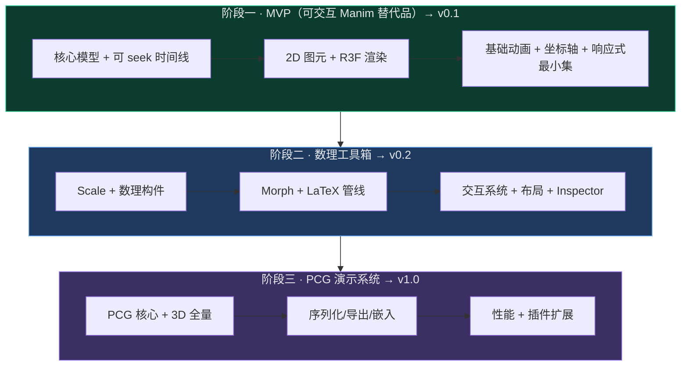
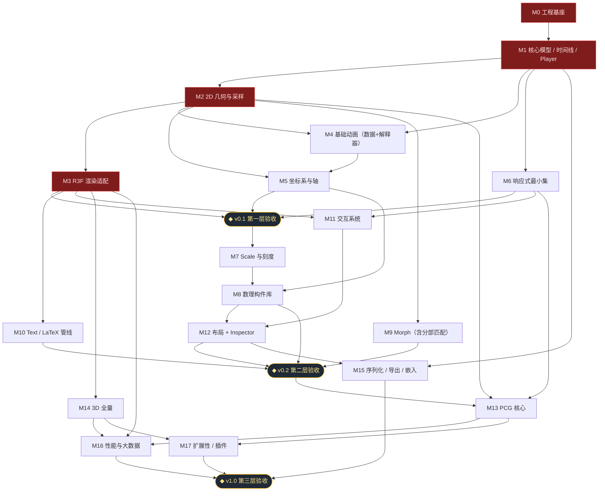
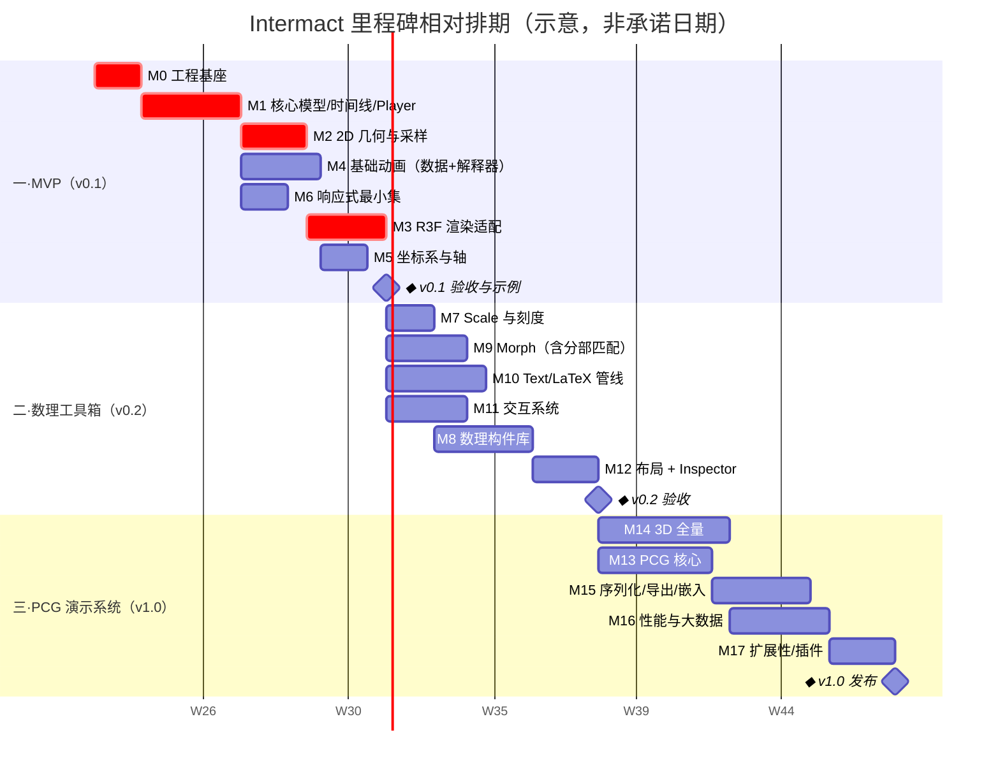
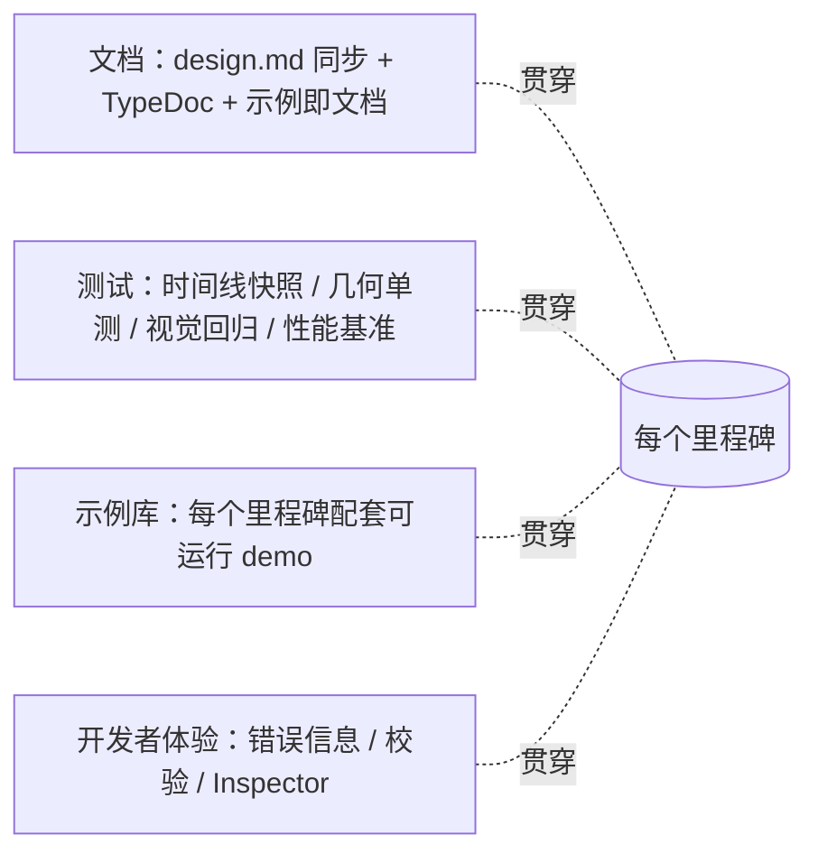

# Intermact 开发里程碑图谱

本文件是 Intermact 的开发路线图，描述从"可交互 Manim 替代品"到"面向数理可视化的 PCG 演示与交互系统"的里程碑划分、依赖关系、相对排期与验收标准。它与 `design.md` 配套：架构/接口的"是什么"在 `design.md`，交付节奏的"何时/按何顺序"在本文件。

> 排期以**相对周（W）**与示意日期表达，用于刻画**顺序与时长占比**，非交付承诺。新里程碑/调整请并入本文件，不要新建独立 md。

## 0. 如何阅读

- **阶段（Phase）**：对应 `design.md §1.1` 的三层同心圆愿景，每层自成一个可发布的能力闭环。
- **里程碑（Milestone, M*）**：阶段内可独立验收的交付单元，含明确的**退出标准（Exit Criteria）**。
- **里程碑节点（◆）**：阶段验收/版本发布点。
- 每个里程碑都标注其对应的 `design.md` 章节，便于查证设计意图。

| 标记 | 含义 |
| --- | --- |
| `crit` | 关键路径，阻塞后续多数工作 |
| `◆` | 阶段闸口 / 版本发布 |
| DoD | Definition of Done，完成定义 |

## 1. 总览：三层愿景 → 三个阶段

每层在前一层之上扩展，且不破坏前一层接口契约（`design.md §1.1`）。每层结束都产出**可发布版本 + 可运行示例集**。

## 2. 里程碑依赖图谱

这是路线图的核心——里程碑之间的依赖 DAG。箭头表示"被依赖 → 依赖方"。关键路径以粗体语义标注（`crit`）。

**关键路径**：`M0 → M1 → M2 → M3 → … → M16 → v1.0`。其中 **M1（可 seek 时间线 + Player）是全局基石**——它决定了确定性、可重放、导出、回归测试能否成立（`design.md §3.2`），必须最先达到稳定。

## 3. 相对排期甘特图

下图表达里程碑的**顺序、并行关系与时长占比**。日期为示意（锚定 W1 为项目启动周），并行轨道反映可由不同人/小组同时推进的工作。

> 总跨度约 **8–10 个月**（单一小团队、串行关键路径）。若在阶段二/三投入并行人力（渲染、数理、PCG 分线），可压缩至约 6–7 个月。

## 4. 阶段一 · MVP（v0.1）

**阶段目标**：跑通"声明对象 → 注册场景 → 构建可 seek 时间线 → 实时渲染 → 拖动进度条/调参"的最小闭环，复刻 Manim 基础体验且具备 Web 交互雏形。

### M0 · 工程基座 `crit`

- **目标**：建立 monorepo、构建链、测试与 CI，落地 `design.md §3.4` 的包边界与 `§3.1` 的依赖规则。
- **依赖**：无。
- **交付物**：
  - monorepo（`core` / `render-three` / `render-r3f` / `react` / `examples`）与 TS 严格模式配置。
  - 构建（Vite/tsup）、单测（Vitest）、lint/format、CI 流水线。
  - 依赖规则校验（如 `dependency-cruiser`）：禁止 `core` 引入 React/three/DOM。
- **退出标准**：CI 绿；一条空示例可启动并渲染空白 Canvas；依赖规则校验生效并阻断违规 import。
- **风险**：低。
- **Examples（目标交付）**：
  - `examples/_template/empty-canvas` — 最小空 Canvas 模板，验证启动、热更新、构建产物。
  - `examples/_smoke/static-circle` — 仅渲染一个静态圆的烟雾测试（不依赖时间线/动画），作为 CI 冒烟用例。

### M1 · 核心模型 / 时间线 / Player `crit`

- **目标**：实现不可变对象模型、trait/capability、不可变 RuntimeState，以及**保留模 Storyboard + 可 seek Player**（`design.md §3.2、§4、§11.1、§11.3`）。
- **依赖**：M0。
- **交付物**：
  - `IMObject`/`ObjectTrait`/`RuntimeState`/`StatePatch` 类型与不可变 store。
  - `Storyboard`/`Track`/`AnimationSpec` 与"构建期累积、播放期求值"的双阶段执行（`§3.2`）。
  - `Player`：`play/pause/seek/setRate/setLoop/jumpToMarker`，纯函数 `Track.evaluate`。
  - 无头运行能力（Node/Worker 中可构建 Storyboard 并按 t 求值）。
- **退出标准**：给定一段构建期程序，可在任意 `t` 确定性求值得到一致 RuntimeState；`seek` 前后帧一致；时间线快照测试通过。
- **风险**：高（架构基石）。**缓解**：先做最小可 seek 原型（仅 tween）打通，再扩展动画种类。
- **Examples（目标交付）**：
  - `examples/timeline/seek-basics` — 单个 tween 的进度条 seek / 变速 / 反向，直观验证可 seek 与确定性。
  - `examples/timeline/headless-eval` — 在 Node 中无头构建 Storyboard 并对采样 `t` 打印 RuntimeState，作为确定性快照基线。
  - `examples/timeline/markers-slides` — 用 `marker` 做幻灯片式跳章（`jumpToMarker`）。

### M2 · 2D 几何与采样 `crit`

- **目标**：2D 图元工厂与几何采样（`design.md §5`）。
- **依赖**：M1。
- **交付物**：Circle/Ellipse/Rectangle/Arc/Polygon/BezierCurve/Line/Arrow；弧长重采样、`SampledPath2D`、`Float32Array` 缓冲通道、earcut 三角化、`getBounds`。
- **退出标准**：各图元采样点数/弧长/bounds 单测通过；闭合与带洞图形三角化正确；缓冲通道与元组通道结果一致。
- **风险**：中（三角化/带洞边界用例）。
- **Examples（目标交付）**：
  - `examples/geometry/primitives-gallery` — 全部 2D 图元一览（含带洞多边形、复合贝塞尔）。
  - `examples/geometry/sampling-debug` — 可视化弧长采样点、bounds 与三角化网格，辅助调试。

### M3 · R3F 渲染适配 `crit`

- **目标**：把 RenderSnapshot 映射到 R3F/Three，落地渲染管线难点（`design.md §15`）。
- **依赖**：M2。
- **交付物**：
  - stroke（含 trim/恒定屏幕宽度选项）、fill（earcut + fillRule）、basic material。
  - `IntermactCanvas`、`Viewport`、z 序/透明处理、DPI/resize + `fit` 策略。
  - `SceneRendererAdapter` 接口与 diff 更新。
- **退出标准**：基础对象在浏览器正确渲染；resize/HiDPI 不失真；stroke trim 随 reveal 平滑；renderer smoke test 不抛错。
- **风险**：中高（WebGL 细线/透明/拾取细节）。
- **Examples（目标交付）**：
  - `examples/render/stroke-fill-showcase` — stroke trim + 各 `fillRule` + 世界单位/像素线宽对照。
  - `examples/render/zorder-transparency` — z 序与半透明排序边界用例。
  - `examples/render/dpi-resize` — HiDPI 与容器 resize 下 `fit` 策略不失真。

### M4 · 基础动画（数据 + 解释器）

- **目标**：Create/Fade/Move/Rotate/Scale/Tween，全部以 `AnimationSpec` 表达并编译为 Track（`design.md §11`）。
- **依赖**：M1、M2。
- **交付物**：动画工厂、`sequence/parallel/stagger/wait/call`、easing 库、Create 的描边/填充 reveal 策略。
- **退出标准**：组合动画可 seek；Create 在 play 前不显示；`call` 被标注为不可 seek 边界并在拖拽预览时告警。
- **风险**：中。
- **Examples（目标交付）**：
  - `examples/anim/create-fade-move` — Create/Fade/Move/Rotate/Scale 动画画廊。
  - `examples/anim/sequence-parallel-stagger` — 串行/并行/错峰（stagger）编排对照。
  - `examples/anim/easing-gallery` — 各 easing 曲线效果对照。

### M5 · 坐标系与轴

- **目标**：cartesian 2D 坐标系、abs/rel/fit 转换、`getAxes` + RegisteredObject 动画（`design.md §7.2、§9.1`）。
- **依赖**：M2、M4。
- **交付物**：`CoordinateTransform2D`、域/视口/纵横比策略、轴淡入淡出动画。
- **退出标准**：abs↔rel 往返一致；不同 `fit` 下布局正确；轴可动画显隐。
- **风险**：低。
- **Examples（目标交付）**：
  - `examples/coords/cartesian-axes` — `getAxes` + `fadeIn`/`fadeOut` 淡入淡出。
  - `examples/coords/fit-strategies` — contain/cover/stretch 与 abs↔rel 往返可视化。
  - `examples/coords/polar-scene` — 极坐标场景与定位。

### M6 · 响应式最小集

- **目标**：`signal/computed/valueTracker` + `derived/addUpdater`（`design.md §8`）。
- **依赖**：M1。
- **交付物**：依赖追踪、最小重算、updater 卸载、`tweenSignal`。
- **退出标准**：信号变化仅重算受影响对象；依赖图无遗漏/冗余；与时间线协同（tween 一个 tracker 驱动 derived）。
- **风险**：中。
- **Examples（目标交付）**：
  - `examples/reactive/value-tracker` — `tweenSignal` 驱动 `derived`（双曲线内接矩形，对应 `design.md §8.2`）。
  - `examples/reactive/leva-binding` — Leva 参数绑定信号、只更新参数不重建 program（`design.md §19.2` 精简版）。

### ◆ v0.1 验收（DoD）

- 可运行示例：基础 2D（Create/Move/Tween）+ 交互函数曲线（拖 Leva 调参，曲线实时重算）。
- 进度条可拖动 seek，结果确定；时间线快照测试纳入 CI。
- `design.md §19.1、§19.2` 示例可跑通。

## 5. 阶段二 · 数理工具箱（v0.2）

**阶段目标**：在 MVP 之上提供数理可视化刚需构件与公式动画能力，达到"能讲清一节微积分/线性代数"的表达力，并让交互探索成为一等能力。

### M7 · Scale 与刻度

- **目标**：linear/log/pow/time Scale + ticks/format（`design.md §7.3`）。
- **依赖**：v0.1（L1）。
- **交付物**：`Scale` 接口与四类实现、`ticks`、`tickFormat`、`invert`。
- **退出标准**：各 Scale 正反映射与刻度单测通过；log 边界、time 跨度用例正确。
- **风险**：低。
- **Examples（目标交付）**：
  - `examples/scale/scale-playground` — linear/log/pow/time 对照与 ticks/format 交互。
  - `examples/scale/log-plot` — 对数坐标作图与刻度格式化。

### M8 · 数理构件库

- **目标**：NumberLine/Axes/NumberPlane/PolarPlane/ComplexPlane、FunctionGraph/Parametric/Area/Riemann/Tangent、Matrix/Table/Brace/DecimalNumber（`design.md §7.4`）。
- **依赖**：M5、M7。
- **交付物**：构件工厂、`RegisteredAxes.handle`（`c2p/p2c`）、依附构件定位、DecimalNumber 随 tracker 实时更新。
- **退出标准**：FunctionGraph/Riemann/Tangent 通过 `c2p` 正确贴合；DecimalNumber 随信号刷新；Matrix/Table 布局正确。
- **风险**：中。
- **Examples（目标交付）**：
  - `examples/math/axes-functiongraph` — Axes + FunctionGraph，`c2p` 贴合验证。
  - `examples/math/riemann-sum` — Riemann 矩形随 `n` 收敛到积分。
  - `examples/math/tangent-derivative` — 切线随动点移动、斜率实时显示。
  - `examples/math/matrix-table-brace` — Matrix/Table/Brace/DecimalNumber 组合。
  - `examples/math/planes` — NumberPlane / PolarPlane / ComplexPlane 一览。

### M9 · Morph（含分部匹配）

- **目标**：arc-length/anchor/cross-fade + **matching** 分部匹配（`design.md §11.4`）。
- **依赖**：M2。
- **交付物**：归一化轮廓、点数对齐、contour 匹配/补齐、`transformMatching`（按 key 的 transformer/remover/introducer）。
- **退出标准**：不同点数/contour 数 morph 平滑；matching 在公式间正确分部变换；property-based 随机形状不崩。
- **风险**：高（拓扑差异、分部匹配稳定性）。**缓解**：先交付 arc-length + cross-fade 兜底，matching 作为增量。
- **Examples（目标交付）**：
  - `examples/morph/shape-morph` — 圆 ↔ 多边形 ↔ 星形（不同点数）平滑过渡。
  - `examples/morph/contour-mismatch` — contour 数不同 + cross-fade 兜底。
  - `examples/morph/matching-shapes` — `transformMatching` 子部件按 key 匹配。

### M10 · Text / LaTeX 管线

- **目标**：KaTeX/MathJax→SVG→path→mesh/SDF、writing、与 M9 联动的 `TransformMatchingTex`（`design.md §13`）。
- **依赖**：M3。
- **交付物**：LaTeX 排版、glyph path 提取与三角化、troika MSDF 文本、逐笔 writing、token→glyph 分部 key。
- **退出标准**：公式可 writing；普通文本清晰可缩放；公式间分部变形可用；字体/LaTeX 异步在构建期 prepare 完成（`§14`）。
- **风险**：高（glyph path 提取、分部映射）。
- **Examples（目标交付）**：
  - `examples/text/writing` — 文本与公式逐笔 writing 效果。
  - `examples/latex/transform-matching-tex` — `a²+b²=c²` 推导的公式分部变形。
  - `examples/text/font-scale` — MSDF 文本任意缩放保持清晰。

### M11 · 交互系统

- **目标**：命中测试、坐标反投影拖拽、`draggablePoint/draggableValue`（`design.md §12`）。
- **依赖**：M3、M6。
- **交付物**：pick 代理几何、raycast 阈值、三套坐标事件、拖拽控制点写信号驱动 derived。
- **退出标准**：细线/空心图形可稳定命中；拖控制点几何实时更新；手势/键盘基础可用。
- **风险**：中高（WebGL 拾取精度）。
- **Examples（目标交付）**：
  - `examples/interaction/draggable-bezier` — 拖控制点实时重算的贝塞尔曲线（`design.md §12.3`）。
  - `examples/interaction/hit-testing` — 细线/空心图形命中高亮与 pick 代理可视化。
  - `examples/interaction/explorable-derivative` — 拖动 `x` 探索切线/导数的可交互演示。

### M12 · 布局 + Inspector

- **目标**：anchor/nextTo/alignTo/fitTo/arrange 与时间线检视器（`design.md §9.4、§16`）。
- **依赖**：M8、M11。
- **交付物**：布局算子（返回动画句柄）、Inspector（registry、对象运行时态、活跃 Track、信号依赖图、bounds/pick 高亮）。
- **退出标准**：相对/网格布局正确；Inspector 能定位对象与诊断坐标/依赖。
- **风险**：中。
- **Examples（目标交付）**：
  - `examples/layout/next-to-arrange` — 标题+公式用 `nextTo/alignTo/arrange` 自动排版。
  - `examples/layout/responsive-rect` — RectTransform/UV 随容器自适应。
  - `examples/devtools/inspector-tour` — Inspector 检视时间线、运行时态与信号依赖图。

### ◆ v0.2 验收（DoD）

- 示例：可交互的微积分演示（Riemann 和随 tracker 收敛、切线随拖动）、公式分部变形、矩阵/表格。
- LaTeX writing 与 `transformMatching` 可用；Inspector 进入 dev 工具链。
- 数理构件、Scale、Morph、交互均有单测与视觉回归覆盖。

## 6. 阶段三 · PCG 演示系统（v1.0）

**阶段目标**：补齐 3D，引入程序化/生成式内容与数据驱动生成，打通序列化/导出/嵌入与性能，成为可分享、可嵌入、可扩展的完整平台。

### M13 · PCG 核心

- **目标**：Field/Sampler、参数/晶格、L-system/fractal/graph/CA、数据驱动、组合算子、种子化 RNG（`design.md §6`）。
- **依赖**：M2、M6。
- **交付物**：标量/向量场、isoline(marching squares)/heatmap/vectorField/streamlines、`lSystem/fractal/recursiveTree/graphObject/cellularAutomaton`、`mapData/barChart/scatter`、`repeat/instanceField/booleanOp/mapPoints/along`、`createRng/fork`。
- **退出标准**：同 seed 生成结果可复现；marching squares 等值线正确；graph/CA 步进可驱动演化动画；组合算子可链式叠加。
- **风险**：中高（生成器广度、确定性保证）。**缓解**：优先 Field/Sampler + 数据驱动（与实验解耦目标最相关），生成式语法按需迭代。
- **Examples（目标交付）**：
  - `examples/pcg/lsystem-plant` — 种子化 L-system 生长动画（`design.md §19.4`）。
  - `examples/pcg/scalar-field-isolines` — 标量场等值线（marching squares）+ heatmap。
  - `examples/pcg/vector-field-streamlines` — 向量场箭头 + 流线积分。
  - `examples/pcg/cellular-automaton` — 元胞自动机演化（如 Game of Life / Rule 30）。
  - `examples/pcg/data-driven-bars` — `mapData/barChart` 数据驱动生成 + key 复用。
  - `examples/pcg/fractal-graph` — 分形与图布局（force/tree/circular）。

### M14 · 3D 全量

- **目标**：3D 对象与相机动画（`design.md §5.3、§10.1`）。
- **依赖**：M3。
- **交付物**：Curve3D/Polyline3D/Mesh/Surface3D/PointCloud3D/Axes3D、3D Create 策略、相机 orbit/dolly/zoom/四元数旋转、marching cubes 等值面。
- **退出标准**：3D 对象可注册/动画/seek；相机动画与 orbit 交互可用；3D 示例（§19.3）跑通。
- **风险**：中。
- **Examples（目标交付）**：
  - `examples/3d/surface-plot` — 参数曲面 + 3D 轴 + orbit 交互。
  - `examples/3d/training-trajectory` — 训练快照可视化（损失曲面/轨迹/点云，`design.md §19.3`）。
  - `examples/3d/isosurface` — marching cubes 等值面。
  - `examples/3d/camera-moves` — 相机 orbit/dolly/zoom 与四元数旋转。
  - `examples/3d/nested-scene-panel` — 3D 子场景作为 2D 面板嵌入（`design.md §19.5`）。

### M15 · 序列化 / 导出 / 嵌入

- **目标**：Storyboard 序列化、分享 URL、视频/快照导出、可嵌入 HTML、语义层、响应式（`design.md §17`）。
- **依赖**：M1、M12。
- **交付物**：`serialize/deserialize`、分享 URL 编码、固定 fps 逐帧导出（视频/GIF）、PNG/SVG 快照、web component/iframe 嵌入、超链接/讲义语义层、`prefers-reduced-motion`。
- **退出标准**：演示可序列化并从 URL 还原；离线导出逐帧确定一致；可嵌入第三方页面；reduced-motion 降级生效。
- **风险**：中（逃生舱 `call/external` 不可序列化的处理）。
- **Examples（目标交付）**：
  - `examples/export/share-url` — 把当前探索状态编码进 URL 并完整还原。
  - `examples/export/video-render` — 固定 fps 离线逐帧导出视频/GIF。
  - `examples/embed/web-component` — 作为 web component / iframe 嵌入静态页。
  - `examples/export/semantic-handout` — 带超链接/旁注的讲义页，尊重 `prefers-reduced-motion`。

### M16 · 性能与大数据

- **目标**：instancing、Worker、Float32Array 通道、大规模数据流（`design.md §15.2`）。
- **依赖**：M3、M13、M14。
- **交付物**：实例化渲染、Worker 化采样/三角化/marching/LaTeX、采样 memoize、性能预算基准。
- **退出标准**：达成既定帧预算（如万级对象/大网格场景维持目标帧率）；性能基准纳入 CI 防退化。
- **风险**：中高。
- **Examples（目标交付）**：
  - `examples/perf/instanced-10k` — 万级实例化对象维持目标帧率。
  - `examples/perf/large-pointcloud` — 大点云/大网格流式加载与渲染。
  - `examples/perf/worker-sampling` — Worker 化采样/三角化前后帧时间对比基准。

### M17 · 扩展性 / 插件

- **目标**：对象/动画/生成器/渲染器注册表与插件系统（`design.md §18`）。
- **依赖**：M13、M14。
- **交付物**：`Registries`、`definePlugin`、扩展点文档；（可选）WebGPU 后端 PoC。
- **退出标准**：用插件新增一个对象类型与一个生成器，不改 core 即生效。
- **风险**：低中。
- **Examples（目标交付）**：
  - `examples/plugin/custom-object` — 插件式新增一个对象类型（注册表注入，不改 core）。
  - `examples/plugin/custom-generator` — 插件式新增一个 PCG 生成器。
  - `examples/plugin/webgpu-backend`（可选）— 注册 WebGPU 渲染后端 PoC。

### ◆ v1.0 发布（DoD）

- 示例：PCG（L-system 生长、向量场/流线、数据驱动图表）、3D 损失曲面、嵌套渲染、可分享 URL。
- 序列化/导出/嵌入可用；性能基准达标；插件机制可用。
- API 文档（TypeDoc）、示例库、迁移/稳定性说明齐备。

## 7. 贯穿性工作流（不计入单一里程碑，持续推进）

- **文档**：每个里程碑落地后同步更新 `design.md` 与"修订记录"，示例代码作为可编译/可运行的活文档（`design.md §19`）。
- **测试**：每里程碑必带对应测试类型（见 `design.md §21`）；时间线快照与性能基准纳入 CI 防回归。
- **示例**：每个里程碑都声明了一组**目标交付 examples**（见 §4–§6 各里程碑的 "Examples" 条目），随里程碑落地沉淀进 `examples/` 形成累积演示库，并复用于视觉回归与各阶段闸口 DoD。`_template/`、`_smoke/` 前缀为脚手架/冒烟用例，其余按能力域分目录（`geometry/`、`anim/`、`math/`、`pcg/`、`3d/`、`interaction/`、`export/`、`plugin/` 等）。
- **开发者体验**：错误码/校验/strict 模式/Inspector 随能力增长持续完善（`design.md §16`）。

## 8. 版本与发布节奏

| 版本 | 闸口 | 能力主题 | 面向用户 |
| --- | --- | --- | --- |
| `v0.1.x` | ◆ L1 | 可交互 Manim 替代品（2D + 时间线 + 调参） | 早期试用、内部演示 |
| `v0.2.x` | ◆ L2 | 数理工具箱（Scale/构件/LaTeX/Morph/交互） | 教学/科普内容作者 |
| `v1.0.0` | ◆ L3 | PCG 演示系统（3D/生成式/导出/嵌入/插件） | 公开发布、可嵌入生产 |

- 阶段内按里程碑发 `minor/patch` 预览版；闸口发对应里程碑版本。
- 公共 API 在 v1.0 前标注稳定性等级（experimental/stable），破坏性变更集中在 minor 边界并记录于 `design.md`。

## 9. 风险登记册

| 风险 | 关联 | 等级 | 缓解策略 |
| --- | --- | --- | --- |
| 可 seek 时间线与命令式书写体验难两全 | M1 | 高 | 先做最小可 seek 原型；`async/await` 仅作构建期糖衣；`call` 显式标注不可 seek 边界 |
| WebGL 细线渲染/拾取精度 | M3、M11 | 高 | 采用 `Line2`/meshline + pick 代理几何 + raycast 阈值；早做视觉验证 |
| LaTeX glyph path 提取与公式分部匹配 | M9、M10 | 高 | arc-length/cross-fade 兜底先行，matching 增量交付；保留 token→glyph 映射 |
| PCG 生成器广度与确定性 | M13 | 中高 | 强制种子化 RNG；优先交付与"实验解耦"最相关的 Field/数据驱动 |
| 大规模数据/3D 性能 | M16 | 中高 | Float32Array 通道 + instancing + Worker；尽早设性能预算并入 CI |
| 范围蔓延（PCG 生成器无止境） | P3 | 中 | 以注册表/插件承接长尾，core 只保留通用抽象 |

## 10. 里程碑速查表

| ID | 名称 | 阶段 | 依赖 | design.md |
| --- | --- | --- | --- | --- |
| M0 | 工程基座 | 一 | — | §3.1、§3.4 |
| M1 | 核心模型/时间线/Player | 一 | M0 | §3.2、§4、§11 |
| M2 | 2D 几何与采样 | 一 | M1 | §5 |
| M3 | R3F 渲染适配 | 一 | M2 | §15 |
| M4 | 基础动画 | 一 | M1、M2 | §11 |
| M5 | 坐标系与轴 | 一 | M2、M4 | §7.2 |
| M6 | 响应式最小集 | 一 | M1 | §8 |
| M7 | Scale 与刻度 | 二 | L1 | §7.3 |
| M8 | 数理构件库 | 二 | M5、M7 | §7.4 |
| M9 | Morph（含分部匹配） | 二 | M2 | §11.4 |
| M10 | Text/LaTeX 管线 | 二 | M3 | §13 |
| M11 | 交互系统 | 二 | M3、M6 | §12 |
| M12 | 布局 + Inspector | 二 | M8、M11 | §9.4、§16 |
| M13 | PCG 核心 | 三 | M2、M6 | §6 |
| M14 | 3D 全量 | 三 | M3 | §5.3、§10.1 |
| M15 | 序列化/导出/嵌入 | 三 | M1、M12 | §17 |
| M16 | 性能与大数据 | 三 | M3、M13、M14 | §15.2 |
| M17 | 扩展性/插件 | 三 | M13、M14 | §18 |
