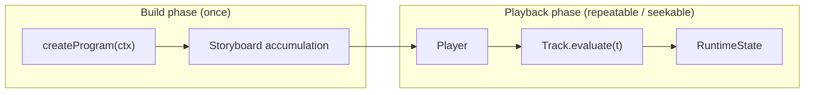

# Architecture Overview

Intermact uses a **retained-mode seekable timeline** as its core execution model (`design.md §3.2`): authors write narrative with `async/await`, but at runtime they get a complete `Storyboard` that can be `seek`ed at any moment for a deterministic `RuntimeState`.

## Two-phase execution



| Phase | What happens | Key types |
| --- | --- | --- |
| Build | Register objects; `scene.play` appends animations and markers | `IntermactProgram`, `AnimationSpec`, `Storyboard` |
| Playback | `seek` / `update` evaluates tracks, produces snapshot | `Player`, `Track`, `RuntimeState2D`, `RenderSnapshot` |

`await scene.play(...)` is build-time syntax sugar: the logical clock advances instantly — it does not wait on wall-clock time.

## Object model

- **`IMObject2D`**: immutable object **definition** (geometry + traits: stroke / fill / morphable …)
- **`RegisteredObject2D`**: scene **instance** with `create` / `fadeIn` / `moveTo` / `tween` etc., returning `Animation` handles
- **`RuntimeState2D`**: playback **runtime state** (position, reveal, opacity, geometryOverride …), patched by pure Track functions

Animation methods only return data (`Animation` / `AnimationSpec`); they compile into the Storyboard at `scene.play`.

## Package layers (§3.1)

```text
@intermact/react
  └── @intermact/render-r3f
        └── @intermact/render-three
              └── @intermact/core   ← must not import React / three / DOM
```

`dependency-cruiser` enforces this in CI. `core` can headlessly build and snapshot-test in Node (see `timeline/headless-eval` example).

## Reactive layer (§8)

Aligned with Manim's `ValueTracker` + `add_updater`:

- **`signal` / `computed`**: observable values with dependency tracking
- **`derived`**: geometry factories with minimal recomputation on dependency change
- **`tweenSignal`**: seekable signal tracks
- **`ReactiveEngine`**: flushed each frame in `Player.prepareFrame`, before render snapshot

Signals created inside `createProgram` are auto-registered via `setSignalRegistrar`.

## Phase-1 & Phase-2 scope

| Phase | Guide chapters | Acceptance checklist |
| --- | --- | --- |
| v0.1 | [Core capabilities](/en/guide/program-and-scene) (program → reactive) | [v0.1 checklist](../project/v01-checklist.md) |
| v0.2 | [Math toolbox](/en/guide/scale) (Scale → Inspector) | [v0.2 checklist](../project/v02-checklist.md) |

Phase-2 delivered: `arc-length` / `anchor` / `matching` / `cross-fade` Morph, `group2D` part keys, OpenType + MathJax text/LaTeX, drag and hit-test, layout and Inspector.

## Known deviations (cross-phase)

- Some `decimalNumber` examples use world coordinates, not UV HUD
- `call` effects are not seekable (skipped during drag preview with a one-time warning)
- Screen-space constant line width is a ribbon approximation; dedicated shader is a future optimization
- matching remover/introducer on single-object channel uses geometry collapse/growth (not per-part alpha)

Architecture details and API contract are authoritative in [`dev-docs/design.md`](https://github.com/clyce/intermact/blob/main/dev-docs/design.md); implementation progress in §0.1 (Phase-1), §0.2 (Phase-2), §0.3 (Phase-3).
