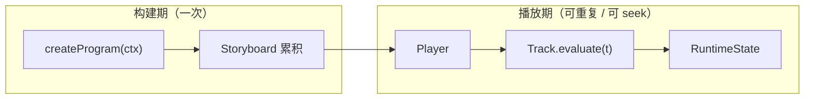

# 架构概览

Intermact 采用 **保留模（retained-mode）可 seek 时间线** 作为核心执行模型（`design.md §3.2`）：作者用 `async/await` 书写叙事，但运行时得到的是完整 `Storyboard`，可在任意时刻 `seek` 并得到确定的 `RuntimeState`。

## 两阶段执行



| 阶段 | 做什么 | 关键类型 |
| --- | --- | --- |
| 构建期 | 注册对象、`scene.play` 追加动画与 marker | `IntermactProgram`, `AnimationSpec`, `Storyboard` |
| 播放期 | `seek` / `update` 求值轨道，生成快照 | `Player`, `Track`, `RuntimeState2D`, `RenderSnapshot` |

`await scene.play(...)` 是构建期的语法糖：逻辑时钟瞬间推进，不会真的等待墙钟时间。

## 对象模型

- **`IMObject2D`**：不可变对象**定义**（几何 + trait：stroke / fill / morphable …）
- **`RegisteredObject2D`**：场景中的**实例**，提供 `create` / `fadeIn` / `moveTo` / `tween` 等，返回 `Animation` 句柄
- **`RuntimeState2D`**：播放期**运行时态**（位置、reveal、opacity、geometryOverride …），由 Track 纯函数 patch

动画方法只返回数据（`Animation` / `AnimationSpec`），在 `scene.play` 时才编译进 Storyboard。

## 包分层（§3.1）

```text
@intermact/react
  └── @intermact/render-r3f
        └── @intermact/render-three
              └── @intermact/core   ← 禁止 import React / three / DOM
```

`dependency-cruiser` 在 CI 中强制上述规则。`core` 可在 Node 中无头构建与快照测试（见 `timeline/headless-eval` 示例）。

## 响应式层（§8）

与 Manim 的 `ValueTracker` + `add_updater` 对齐：

- **`signal` / `computed`**：带依赖追踪的可观察值
- **`derived`**：几何工厂，依赖变化时最小重算
- **`tweenSignal`**：可 seek 的信号轨道
- **`ReactiveEngine`**：每帧 `Player.prepareFrame` 时 flush，在渲染快照前完成重算

构建期通过 `setSignalRegistrar` 自动注册 program 内创建的信号。

## v0.1 范围与已知偏差

完整列表见 [v0.1 验收清单](../project/v01-checklist.md)。摘要：

- Morph 仅 **arc-length** 策略；分部 matching 在 M9
- `decimalNumber` 示例用世界坐标定位，非 UV HUD
- `call` 效果不可 seek（拖拽预览时跳过并告警一次）
- 屏幕空间恒定线宽为 ribbon 近似；专用 shader 后续里程碑

架构细节与 API 契约以 [`dev-docs/design.md`](https://github.com/intermact/intermact/blob/main/dev-docs/design.md) 为准；实现进度日志见 §0.1。
