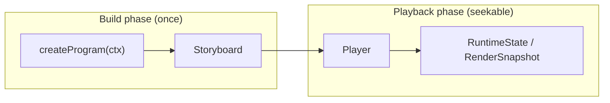

# Intermact API Reference

This overview covers the architecture and entry points for **v0.1–v1.0 (Phase-1 / Phase-2 / Phase-3)** public API; individual symbol pages are generated by [TypeDoc](https://typedoc.org/) from exports and TSDoc comments in `packages/*/src`. Phase-3 (PCG / 3D / serialization export / plugins) API map is in **§Phase-3** below; concept guides at [PCG](/en/guide/pcg) / [3D](/en/guide/3d) / [Export & embed](/en/guide/export-embed) / [Performance](/en/guide/performance) / [Extensibility](/en/guide/extensibility).

> Full contract and revision history in repo [`dev-docs/design.md`](https://github.com/clyce/intermact/blob/main/dev-docs/design.md). Conceptual tutorial: [Guide · Architecture overview](/en/guide/architecture).

## Vision and API boundaries

| Phase | Version | Theme | Relation to this doc |
| --- | --- | --- | --- |
| **Phase-1** | v0.1 | Interactive Manim alternative: 2D primitives, seekable timeline, coordinate axes, reactive tuning | **Overview §Phase-1** |
| **Phase-2** | v0.2 | Math toolbox: Scale, LaTeX, Morph matching, interaction picking, layout | **Overview §Phase-2** |
| Phase-3 | v1.0 | PCG, full 3D, serialization/export/embed, plugins | Symbol pages + [Plugin guide](/en/guide/extensibility) |

## Core execution model: seekable timeline

Intermact uses a **retained-mode timeline** (`design.md §3.2`):



| Phase | Responsibility | Key API |
| --- | --- | --- |
| Build | Register objects; `scene.play` **appends** tracks to Storyboard | [`createProgram`](/reference/@intermact/core/functions/createProgram), [`buildProgram`](/reference/@intermact/core/functions/buildProgram), [`Scene2D`](/reference/@intermact/core/classes/Scene2D) |
| Playback | `seek` / `update` pure-function evaluation; deterministic snapshot | [`Player`](/reference/@intermact/core/classes/Player), [`Track`](/reference/@intermact/core/interfaces/Track), [`RenderSnapshot`](/reference/@intermact/core/interfaces/RenderSnapshot) |

`await scene.play(...)` is build-time syntax sugar: logical clock advances instantly, no wall-clock time consumed.

## Object three layers: definition · instance · runtime state

```text
IMObject2D (immutable definition: geometry + trait)
    └── scene.register(...) → RegisteredObject2D (animation handle: create / moveTo / morphTo …)
            └── Track evaluation → RuntimeState2D (position, reveal, opacity, geometryOverride …)
```

- **Definition layer**: [`IMObject2D`](/reference/@intermact/core/interfaces/IMObject2D) + traits ([`stroke`](/reference/@intermact/core/interfaces/StrokeTrait) / [`fill`](/reference/@intermact/core/interfaces/FillTrait) / [`morphable`](/reference/@intermact/core/interfaces/MorphableTrait) / [`textLayout`](/reference/@intermact/core/interfaces/TextLayoutTrait)); primitive factories like [`circle`](/reference/@intermact/core/functions/circle), [`polygon`](/reference/@intermact/core/functions/polygon).
- **Instance layer**: [`RegisteredObject2D`](/reference/@intermact/core/classes/RegisteredObject2D) — animation methods return [`Animation`](/reference/@intermact/core/interfaces/Animation) data, compiled at `play`.
- **Runtime layer**: [`RuntimeState2D`](/reference/@intermact/core/interfaces/RuntimeState2D) + [`applyPatch2D`](/reference/@intermact/core/functions/applyPatch2D); renderer consumes [`RenderSnapshot`](/reference/@intermact/core/interfaces/RenderSnapshot).

## Scene · Camera · Canvas decoupling

Unlike Manim, scene, camera, and canvas are layered (`design.md §9–10`):

| Layer | Role | Key API |
| --- | --- | --- |
| **Scene2D** | Coordinate domain, object registration, `getAxes`, orchestrates `play` | [`Scene2D`](/reference/@intermact/core/classes/Scene2D) |
| **Camera** | Orthographic camera description, mounted to viewport | [`createCamera2D`](/reference/@intermact/core/functions/createCamera2D) |
| **Canvas** | React entry: build program, R3F canvas, timeline overlay | [`IntermactCanvas`](/reference/@intermact/react/functions/IntermactCanvas) |

Coordinate transforms: [`CoordinateTransform2D`](/reference/@intermact/core/classes/CoordinateTransform2D) (abs/rel, polar). Axis objects register via `Scene2D.getAxes`; ticks generated by Scale (Phase-2).

## Package layers and render pipeline

```text
@intermact/react
  └── @intermact/render-r3f     SceneView, computeFit
        └── @intermact/render-three   stroke/fill geometry, ThreeSceneView
              └── @intermact/core     no React / three / DOM
```

| Package | Responsibility |
| --- | --- |
| [`@intermact/core`](/reference/@intermact/core/) | Model, geometry, timeline, reactive, Scale/constructs/text/interaction; headless in Node |
| [`@intermact/render-three`](/reference/@intermact/render-three/) | `RenderSnapshot` → three.js geometry (stroke trim, earcut fill) |
| [`@intermact/render-r3f`](/reference/@intermact/render-r3f/) | R3F diff update, camera fit, HiDPI |
| [`@intermact/react`](/reference/@intermact/react/) | `IntermactCanvas`, `useSignal`, timeline controls, Inspector |

Data flow: `Player.getSnapshot()` → [`ThreeSceneView`](/reference/@intermact/render-three/classes/ThreeSceneView) diff → R3F [`SceneView`](/reference/@intermact/render-r3f/functions/SceneView).

---

## Phase-1 (v0.1): basic 2D narrative

Guides: [Program and scene](/en/guide/program-and-scene) · [Timeline](/en/guide/timeline-and-player) · [Geometry](/en/guide/geometry) · [Rendering](/en/guide/rendering) · [Animation](/en/guide/animation) · [Coordinates](/en/guide/coordinates) · [Reactive](/en/guide/reactive)

| Capability | API entry |
| --- | --- |
| 2D primitives | [`circle`](/reference/@intermact/core/functions/circle), [`rectangle`](/reference/@intermact/core/functions/rectangle), [`polygon`](/reference/@intermact/core/functions/polygon), [`bezierCurve`](/reference/@intermact/core/functions/bezierCurve), [`arrow`](/reference/@intermact/core/functions/arrow) |
| Create / Fade / Move / Tween | [`RegisteredObject2D`](/reference/@intermact/core/classes/RegisteredObject2D), [`compileSpec`](/reference/@intermact/core/functions/compileSpec) |
| Orchestration | [`sequence`](/reference/@intermact/core/functions/sequence), [`parallel`](/reference/@intermact/core/functions/parallel), [`stagger`](/reference/@intermact/core/functions/stagger), [`wait`](/reference/@intermact/core/functions/wait) |
| Coordinates and axes | [`CoordinateTransform2D`](/reference/@intermact/core/classes/CoordinateTransform2D), [`Scene2D.getAxes`](/reference/@intermact/core/classes/Scene2D) |
| Reactive tuning | [`signal`](/reference/@intermact/core/functions/signal), [`derived`](/reference/@intermact/core/functions/derived), [`tweenSignal`](/reference/@intermact/core/functions/tweenSignal), [`useSignal`](/reference/@intermact/react/functions/useSignal) |
| Side effects (**not seekable**) | [`call`](/reference/@intermact/core/functions/call) |

---

## Phase-2 (v0.2): math toolbox

Guides: [Scale](/en/guide/scale) · [Math constructs](/en/guide/math-constructs) · [Morph](/en/guide/morph) · [Text and LaTeX](/en/guide/text-latex) · [Interaction](/en/guide/interaction) · [Layout and Inspector](/en/guide/layout-inspector)

### Scale and ticks (M7)

| Capability | API entry |
| --- | --- |
| Scale types | [`linearScale`](/reference/@intermact/core/functions/linearScale), [`logScale`](/reference/@intermact/core/functions/logScale), [`normalizeScale`](/reference/@intermact/core/functions/normalizeScale) |
| Tick generation | [`numericTicks`](/reference/@intermact/core/functions/numericTicks) |
| Axis handle | [`createAxesHandle`](/reference/@intermact/core/functions/createAxesHandle), [`AxesHandle`](/reference/@intermact/core/interfaces/AxesHandle) (`c2p` / `xScale` / `yScale`) |

### Math construct library (M8)

| Capability | API entry |
| --- | --- |
| Coordinate planes | [`numberLine`](/reference/@intermact/core/functions/numberLine), [`numberPlane`](/reference/@intermact/core/functions/numberPlane), [`polarPlane`](/reference/@intermact/core/functions/polarPlane), [`complexPlane`](/reference/@intermact/core/functions/complexPlane) |
| Curves and integration | [`functionGraph`](/reference/@intermact/core/functions/functionGraph), [`parametricGraph`](/reference/@intermact/core/functions/parametricGraph), [`areaUnderCurve`](/reference/@intermact/core/functions/areaUnderCurve), [`riemannRectangles`](/reference/@intermact/core/functions/riemannRectangles), [`tangentLine`](/reference/@intermact/core/functions/tangentLine) |
| Expression and annotation | [`matrixObject`](/reference/@intermact/core/functions/matrixObject), [`tableObject`](/reference/@intermact/core/functions/tableObject), [`brace`](/reference/@intermact/core/functions/brace), [`decimalNumber`](/reference/@intermact/core/functions/decimalNumber) |

### Morph and part matching (M9)

| Strategy | API entry |
| --- | --- |
| `arc-length` / `anchor` / `matching` / `cross-fade` | [`morph`](/reference/@intermact/core/functions/morph), [`transformMatching`](/reference/@intermact/core/functions/transformMatching) |
| Composite object part keys | [`group2D`](/reference/@intermact/core/functions/group2D) |
| Instance methods | [`RegisteredObject2D.morphTo`](/reference/@intermact/core/classes/RegisteredObject2D), [`transformMatchingTo`](/reference/@intermact/core/classes/RegisteredObject2D) |

### Text and LaTeX (M10)

| Capability | API entry |
| --- | --- |
| Fonts | [`loadOutlineFontFromBuffer`](/reference/@intermact/core/functions/loadOutlineFontFromBuffer), [`setDefaultFont`](/reference/@intermact/core/functions/setDefaultFont), [`createAssetManager`](/reference/@intermact/core/functions/createAssetManager) |
| Text objects | [`textObject`](/reference/@intermact/core/functions/textObject), [`glyphText`](/reference/@intermact/core/functions/glyphText) |
| LaTeX | [`layoutMathJaxLatex`](/reference/@intermact/core/functions/layoutMathJaxLatex), [`latexObjectFromGlyphs`](/reference/@intermact/core/functions/latexObjectFromGlyphs) |
| Writing animation | [`glyphLocalReveal`](/reference/@intermact/core/functions/glyphLocalReveal), [`computeGlyphRevealSpans`](/reference/@intermact/core/functions/computeGlyphRevealSpans) |
| Formula part morph | [`transformMatchingTex`](/reference/@intermact/core/functions/transformMatchingTex) (token → part key, reuses matching) |

### Interaction system (M11)

| Capability | API entry |
| --- | --- |
| Draggable sources | [`draggablePoint`](/reference/@intermact/core/functions/draggablePoint), [`draggableValue`](/reference/@intermact/core/functions/draggableValue), [`draggablePointSource`](/reference/@intermact/core/functions/draggablePointSource), [`draggableValueSource`](/reference/@intermact/core/functions/draggableValueSource) |
| Hit testing | [`hitTest`](/reference/@intermact/core/functions/hitTest), [`hitProxy`](/reference/@intermact/core/functions/hitProxy), [`interactive`](/reference/@intermact/core/functions/interactive) |
| Pick helpers | [`pickRectFromObject`](/reference/@intermact/core/functions/pickRectFromObject), [`pickBandFromObject`](/reference/@intermact/core/functions/pickBandFromObject) |

### Layout and Inspector (M12)

| Capability | API entry |
| --- | --- |
| Relative layout | [`LayoutHandle`](/reference/@intermact/core/interfaces/LayoutHandle) (`RegisteredObject2D.layout`: `alignTo` / `nextTo` / `arrange` / `fitTo`) |
| Layout handle factory | [`createLayoutHandle`](/reference/@intermact/core/functions/createLayoutHandle) |
| Dev tools | [`Inspector`](/reference/@intermact/react/functions/Inspector) (React-side scene tree / signals / snapshot debug) |

---

## Phase-3 (v1.0): PCG · 3D · serialization export · plugins

Guides: [Procedural generation](/en/guide/pcg) · [3D scenes and cameras](/en/guide/3d) · [Export, share, and embed](/en/guide/export-embed) · [Performance and big data](/en/guide/performance) · [Extensibility](/en/guide/extensibility)

### PCG procedural generation (M13)

| Capability | API entry |
| --- | --- |
| Parametric / lattice / tiling | [`parametricCurve2D`](/reference/@intermact/core/functions/parametricCurve2D), [`lattice`](/reference/@intermact/core/functions/lattice), [`tiling`](/reference/@intermact/core/functions/tiling) |
| Fractal / rules | [`fractal`](/reference/@intermact/core/functions/fractal), [`recursiveTree`](/reference/@intermact/core/functions/recursiveTree), [`lSystem`](/reference/@intermact/core/functions/lSystem), [`cellularAutomaton`](/reference/@intermact/core/functions/cellularAutomaton), [`cellularAutomatonFrames`](/reference/@intermact/core/functions/cellularAutomatonFrames) |
| Fields | [`functionGraph`](/reference/@intermact/core/functions/functionGraph), [`isoline`](/reference/@intermact/core/functions/isoline), [`heatmap`](/reference/@intermact/core/functions/heatmap), [`streamlines`](/reference/@intermact/core/functions/streamlines) |
| Graph / data | [`graphObject`](/reference/@intermact/core/functions/graphObject), [`barChart`](/reference/@intermact/core/functions/barChart), [`scatter`](/reference/@intermact/core/functions/scatter), [`lineChart`](/reference/@intermact/core/functions/lineChart), [`mapData`](/reference/@intermact/core/functions/mapData) |
| Combinator operators | [`transformObject`](/reference/@intermact/core/functions/transformObject), [`repeatObject`](/reference/@intermact/core/functions/repeatObject), [`instanceField`](/reference/@intermact/core/functions/instanceField), [`mapPoints`](/reference/@intermact/core/functions/mapPoints), [`along`](/reference/@intermact/core/functions/along), [`booleanOp`](/reference/@intermact/core/functions/booleanOp) |

### Full 3D (M14)

| Capability | API entry |
| --- | --- |
| Scene / camera | [`Scene3D`](/reference/@intermact/core/classes/Scene3D), [`RegisteredCamera3D`](/reference/@intermact/core/classes/RegisteredCamera3D), [`CoordinateTransform3D`](/reference/@intermact/core/classes/CoordinateTransform3D) |
| 3D factories | [`polyline3D`](/reference/@intermact/core/functions/polyline3D), [`curve3D`](/reference/@intermact/core/functions/curve3D), [`meshObject`](/reference/@intermact/core/functions/meshObject), [`surface3D`](/reference/@intermact/core/functions/surface3D), [`pointCloud3D`](/reference/@intermact/core/functions/pointCloud3D), [`axes3D`](/reference/@intermact/core/functions/axes3D) |
| Scalar field isosurface | [`isosurface`](/reference/@intermact/core/functions/isosurface), [`marchingCubes`](/reference/@intermact/core/functions/marchingCubes) |
| Nested sub-scenes | [`RegisteredObject2D.layout`](/reference/@intermact/core/classes/RegisteredObject2D) · `render(scene, camera)` (render-r3f `RenderedScene`) |

### Serialization / export / embed (M15)

| Capability | API entry |
| --- | --- |
| Serialization | [`serialize`](/reference/@intermact/core/functions/serialize), [`deserialize`](/reference/@intermact/core/functions/deserialize) |
| Share links | [`encodeShareUrl`](/reference/@intermact/core/functions/encodeShareUrl), [`decodeShareUrl`](/reference/@intermact/core/functions/decodeShareUrl), [`SerializedCanvas`](/reference/@intermact/react/functions/SerializedCanvas) |
| Headless frames | [`snapshotToSVG`](/reference/@intermact/core/functions/snapshotToSVG), [`sampleFrames`](/reference/@intermact/core/functions/sampleFrames), [`sampleFrameHashes`](/reference/@intermact/core/functions/sampleFrameHashes) |
| Video / GIF | [`recordCanvasVideo`](/reference/@intermact/react/functions/recordCanvasVideo), [`captureFrameSequencePng`](/reference/@intermact/react/functions/captureFrameSequencePng), [`encodeGif`](/reference/@intermact/react/functions/encodeGif), [`exportCanvasGif`](/reference/@intermact/react/functions/exportCanvasGif) |
| Embed | [`defineIntermactEmbed`](/reference/@intermact/react/functions/defineIntermactEmbed), [`buildEmbedIframe`](/reference/@intermact/react/functions/buildEmbedIframe) |

### Performance and extensibility (M16 / M17)

| Capability | API entry |
| --- | --- |
| GPU instancing / point cloud | [`instanceField`](/reference/@intermact/core/functions/instanceField), [`pointCloud3D`](/reference/@intermact/core/functions/pointCloud3D) |
| Registries | [`createRegistries`](/reference/@intermact/core/functions/createRegistries), [`globalRegistries`](/reference/@intermact/core/variables/globalRegistries) |
| Plugins | [`definePlugin`](/reference/@intermact/core/functions/definePlugin), [`installPlugin`](/reference/@intermact/core/functions/installPlugin), [`defineObjectType`](/reference/@intermact/core/functions/defineObjectType), [`defineGenerator`](/reference/@intermact/core/functions/defineGenerator) |
| Generator dispatch | [`runGenerator`](/reference/@intermact/core/functions/runGenerator), [`selectRenderer`](/reference/@intermact/core/functions/selectRenderer) |

---

## Reactive layer (interactive state)

Aligned with Manim `ValueTracker` + `add_updater` (`design.md §8`), for **parameter-driven geometry recomputation**:

- [`signal`](/reference/@intermact/core/functions/signal) / [`computed`](/reference/@intermact/core/functions/computed)
- [`derived`](/reference/@intermact/core/functions/derived) + [`ReactiveEngine`](/reference/@intermact/core/classes/ReactiveEngine)
- [`tweenSignal`](/reference/@intermact/core/functions/tweenSignal), [`bindSignal`](/reference/@intermact/core/functions/bindSignal), [`useSignal`](/reference/@intermact/react/functions/useSignal)

Each frame: `Player.prepareFrame` → `ReactiveEngine.flush` → then generate `RenderSnapshot`.

## How to browse symbols

1. Enter package index pages from **Packages** below.
2. Sidebar browse by Classes / Interfaces / Functions (includes all Phase-2 exports).
3. To change API docs, edit source TSDoc and run `pnpm run gen:reference` to regenerate.

## Packages

<!-- PACKAGES -->
