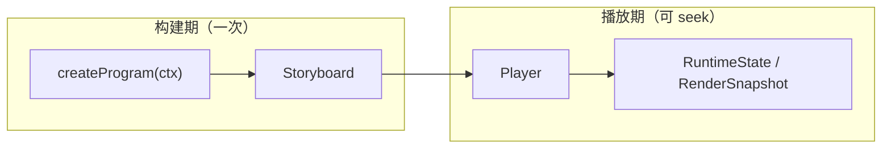

# Intermact API Reference

本文档总览 **v0.1–v1.0（Phase-1 / Phase-2 / Phase-3）** 公共 API 的架构与入口；各符号页由 [TypeDoc](https://typedoc.org/) 从 `packages/*/src` 的导出项与 TSDoc 注释自动生成。Phase-3（PCG / 3D / 序列化导出 / 插件）的 API 地图见下文 **§Phase-3**，概念教程见 [PCG](/guide/pcg) / [3D](/guide/3d) / [导出嵌入](/guide/export-embed) / [性能](/guide/performance) / [扩展系统](/guide/extensibility)。

> 完整契约与修订记录见仓库 [`dev-docs/design.md`](https://github.com/intermact/intermact/blob/main/dev-docs/design.md)。概念性教程见 [指南 · 架构概览](/guide/architecture)。

## 愿景与 API 边界

| 阶段 | 版本 | 主题 | 与本文档关系 |
| --- | --- | --- | --- |
| **Phase-1** | v0.1 | 可交互 Manim 替代品：2D 图元、可 seek 时间线、坐标轴、响应式调参 | **总览 §Phase-1** |
| **Phase-2** | v0.2 | 数理工具箱：Scale、LaTeX、Morph matching、交互拾取、布局 | **总览 §Phase-2** |
| Phase-3 | v1.0 | PCG、3D 全量、序列化/导出/嵌入、插件 | 符号页 + [插件指南](/guide/extensibility) |

## 核心执行模型：可 seek 时间线

Intermact 采用**保留模（retained-mode）时间线**（`design.md §3.2`）：



| 阶段 | 职责 | 关键 API |
| --- | --- | --- |
| 构建期 | 注册对象；`scene.play` 向 Storyboard **追加**轨道 | [`createProgram`](/reference/@intermact/core/functions/createProgram), [`buildProgram`](/reference/@intermact/core/functions/buildProgram), [`Scene2D`](/reference/@intermact/core/classes/Scene2D) |
| 播放期 | `seek` / `update` 纯函数求值；确定性快照 | [`Player`](/reference/@intermact/core/classes/Player), [`Track`](/reference/@intermact/core/interfaces/Track), [`RenderSnapshot`](/reference/@intermact/core/interfaces/RenderSnapshot) |

`await scene.play(...)` 是构建期语法糖，逻辑时钟瞬间推进，不消耗墙钟时间。

## 对象三层：定义 · 实例 · 运行时态

```text
IMObject2D（不可变定义：几何 + trait）
    └── scene.register(...) → RegisteredObject2D（动画句柄：create / moveTo / morphTo …）
            └── Track 求值 → RuntimeState2D（位置、reveal、opacity、geometryOverride …）
```

- **定义层**：[`IMObject2D`](/reference/@intermact/core/interfaces/IMObject2D) + trait（[`stroke`](/reference/@intermact/core/interfaces/StrokeTrait) / [`fill`](/reference/@intermact/core/interfaces/FillTrait) / [`morphable`](/reference/@intermact/core/interfaces/MorphableTrait) / [`textLayout`](/reference/@intermact/core/interfaces/TextLayoutTrait)）；图元工厂如 [`circle`](/reference/@intermact/core/functions/circle)、[`polygon`](/reference/@intermact/core/functions/polygon)。
- **实例层**：[`RegisteredObject2D`](/reference/@intermact/core/classes/RegisteredObject2D)——动画方法返回 [`Animation`](/reference/@intermact/core/interfaces/Animation) 数据，在 `play` 时编译。
- **运行时层**：[`RuntimeState2D`](/reference/@intermact/core/interfaces/RuntimeState2D) + [`applyPatch2D`](/reference/@intermact/core/functions/applyPatch2D)；渲染器消费 [`RenderSnapshot`](/reference/@intermact/core/interfaces/RenderSnapshot)。

## Scene · Camera · Canvas 解耦

与 Manim 不同，场景、相机、画布分层（`design.md §9–10`）：

| 层 | 角色 | 关键 API |
| --- | --- | --- |
| **Scene2D** | 坐标域、对象注册、`getAxes`、编排 `play` | [`Scene2D`](/reference/@intermact/core/classes/Scene2D) |
| **Camera** | 正交相机描述，挂载到视口 | [`createCamera2D`](/reference/@intermact/core/functions/createCamera2D) |
| **Canvas** | React 入口：构建 program、R3F 画布、时间线叠层 | [`IntermactCanvas`](/reference/@intermact/react/functions/IntermactCanvas) |

坐标变换：[`CoordinateTransform2D`](/reference/@intermact/core/classes/CoordinateTransform2D)（abs/rel、极坐标）。轴对象通过 `Scene2D.getAxes` 注册，刻度由 Scale 生成（Phase-2）。

## 包分层与渲染管线

```text
@intermact/react
  └── @intermact/render-r3f     SceneView、computeFit
        └── @intermact/render-three   stroke/fill 几何、ThreeSceneView
              └── @intermact/core     禁止 React / three / DOM
```

| 包 | 职责 |
| --- | --- |
| [`@intermact/core`](/reference/@intermact/core/) | 模型、几何、时间线、响应式、Scale/构件/文本/交互；可 Node 无头运行 |
| [`@intermact/render-three`](/reference/@intermact/render-three/) | `RenderSnapshot` → three.js 几何（stroke trim、earcut fill） |
| [`@intermact/render-r3f`](/reference/@intermact/render-r3f/) | R3F 内 diff 更新、相机 fit、HiDPI |
| [`@intermact/react`](/reference/@intermact/react/) | `IntermactCanvas`、`useSignal`、时间线控件、Inspector |

数据流：`Player.getSnapshot()` → [`ThreeSceneView`](/reference/@intermact/render-three/classes/ThreeSceneView) diff → R3F [`SceneView`](/reference/@intermact/render-r3f/functions/SceneView)。

---

## Phase-1（v0.1）：基础 2D 叙事

指南：[程序与场景](/guide/program-and-scene) · [时间线](/guide/timeline-and-player) · [几何](/guide/geometry) · [渲染](/guide/rendering) · [动画](/guide/animation) · [坐标系](/guide/coordinates) · [响应式](/guide/reactive)

| 能力 | API 入口 |
| --- | --- |
| 2D 图元 | [`circle`](/reference/@intermact/core/functions/circle), [`rectangle`](/reference/@intermact/core/functions/rectangle), [`polygon`](/reference/@intermact/core/functions/polygon), [`bezierCurve`](/reference/@intermact/core/functions/bezierCurve), [`arrow`](/reference/@intermact/core/functions/arrow) |
| Create / Fade / Move / Tween | [`RegisteredObject2D`](/reference/@intermact/core/classes/RegisteredObject2D), [`compileSpec`](/reference/@intermact/core/functions/compileSpec) |
| 编排 | [`sequence`](/reference/@intermact/core/functions/sequence), [`parallel`](/reference/@intermact/core/functions/parallel), [`stagger`](/reference/@intermact/core/functions/stagger), [`wait`](/reference/@intermact/core/functions/wait) |
| 坐标与轴 | [`CoordinateTransform2D`](/reference/@intermact/core/classes/CoordinateTransform2D), [`Scene2D.getAxes`](/reference/@intermact/core/classes/Scene2D) |
| 响应式调参 | [`signal`](/reference/@intermact/core/functions/signal), [`derived`](/reference/@intermact/core/functions/derived), [`tweenSignal`](/reference/@intermact/core/functions/tweenSignal), [`useSignal`](/reference/@intermact/react/functions/useSignal) |
| 副作用（**不可 seek**） | [`call`](/reference/@intermact/core/functions/call) |

---

## Phase-2（v0.2）：数理工具箱

指南：[Scale](/guide/scale) · [数理构件](/guide/math-constructs) · [Morph](/guide/morph) · [文本与 LaTeX](/guide/text-latex) · [交互](/guide/interaction) · [布局与 Inspector](/guide/layout-inspector)

### Scale 与刻度（M7）

| 能力 | API 入口 |
| --- | --- |
| 标度类型 | [`linearScale`](/reference/@intermact/core/functions/linearScale), [`logScale`](/reference/@intermact/core/functions/logScale), [`normalizeScale`](/reference/@intermact/core/functions/normalizeScale) |
| 刻度生成 | [`numericTicks`](/reference/@intermact/core/functions/numericTicks) |
| 轴句柄 | [`createAxesHandle`](/reference/@intermact/core/functions/createAxesHandle), [`AxesHandle`](/reference/@intermact/core/interfaces/AxesHandle)（`c2p` / `xScale` / `yScale`） |

### 数理构件库（M8）

| 能力 | API 入口 |
| --- | --- |
| 坐标平面 | [`numberLine`](/reference/@intermact/core/functions/numberLine), [`numberPlane`](/reference/@intermact/core/functions/numberPlane), [`polarPlane`](/reference/@intermact/core/functions/polarPlane), [`complexPlane`](/reference/@intermact/core/functions/complexPlane) |
| 曲线与积分 | [`functionGraph`](/reference/@intermact/core/functions/functionGraph), [`parametricGraph`](/reference/@intermact/core/functions/parametricGraph), [`areaUnderCurve`](/reference/@intermact/core/functions/areaUnderCurve), [`riemannRectangles`](/reference/@intermact/core/functions/riemannRectangles), [`tangentLine`](/reference/@intermact/core/functions/tangentLine) |
| 表达与标注 | [`matrixObject`](/reference/@intermact/core/functions/matrixObject), [`tableObject`](/reference/@intermact/core/functions/tableObject), [`brace`](/reference/@intermact/core/functions/brace), [`decimalNumber`](/reference/@intermact/core/functions/decimalNumber) |

### Morph 与分部匹配（M9）

| 策略 | API 入口 |
| --- | --- |
| `arc-length` / `anchor` / `matching` / `cross-fade` | [`morph`](/reference/@intermact/core/functions/morph), [`transformMatching`](/reference/@intermact/core/functions/transformMatching) |
| 复合对象部件 key | [`group2D`](/reference/@intermact/core/functions/group2D) |
| 实例方法 | [`RegisteredObject2D.morphTo`](/reference/@intermact/core/classes/RegisteredObject2D), [`transformMatchingTo`](/reference/@intermact/core/classes/RegisteredObject2D) |

### 文本与 LaTeX（M10）

| 能力 | API 入口 |
| --- | --- |
| 字体 | [`loadOutlineFontFromBuffer`](/reference/@intermact/core/functions/loadOutlineFontFromBuffer), [`setDefaultFont`](/reference/@intermact/core/functions/setDefaultFont), [`createAssetManager`](/reference/@intermact/core/functions/createAssetManager) |
| 文本对象 | [`textObject`](/reference/@intermact/core/functions/textObject), [`glyphText`](/reference/@intermact/core/functions/glyphText) |
| LaTeX | [`layoutMathJaxLatex`](/reference/@intermact/core/functions/layoutMathJaxLatex), [`latexObjectFromGlyphs`](/reference/@intermact/core/functions/latexObjectFromGlyphs) |
| Writing 动画 | [`glyphLocalReveal`](/reference/@intermact/core/functions/glyphLocalReveal), [`computeGlyphRevealSpans`](/reference/@intermact/core/functions/computeGlyphRevealSpans) |
| 公式分部变形 | [`transformMatchingTex`](/reference/@intermact/core/functions/transformMatchingTex)（token → 部件 key，复用 matching） |

### 交互系统（M11）

| 能力 | API 入口 |
| --- | --- |
| 可拖拽源 | [`draggablePoint`](/reference/@intermact/core/functions/draggablePoint), [`draggableValue`](/reference/@intermact/core/functions/draggableValue), [`draggablePointSource`](/reference/@intermact/core/functions/draggablePointSource), [`draggableValueSource`](/reference/@intermact/core/functions/draggableValueSource) |
| 命中测试 | [`hitTest`](/reference/@intermact/core/functions/hitTest), [`hitProxy`](/reference/@intermact/core/functions/hitProxy), [`interactive`](/reference/@intermact/core/functions/interactive) |
| 拾取辅助 | [`pickRectFromObject`](/reference/@intermact/core/functions/pickRectFromObject), [`pickBandFromObject`](/reference/@intermact/core/functions/pickBandFromObject) |

### 布局与 Inspector（M12）

| 能力 | API 入口 |
| --- | --- |
| 相对排版 | [`LayoutHandle`](/reference/@intermact/core/interfaces/LayoutHandle)（`RegisteredObject2D.layout`：`alignTo` / `nextTo` / `arrange` / `fitTo`） |
| 布局句柄工厂 | [`createLayoutHandle`](/reference/@intermact/core/functions/createLayoutHandle) |
| 开发工具 | [`Inspector`](/reference/@intermact/react/functions/Inspector)（React 侧场景树 / 信号 / 快照调试） |

---

## Phase-3（v1.0）：PCG · 3D · 序列化导出 · 插件

指南：[程序化生成](/guide/pcg) · [3D 场景与相机](/guide/3d) · [导出、分享与嵌入](/guide/export-embed) · [性能与大数据](/guide/performance) · [扩展系统](/guide/extensibility)

### PCG 程序化生成（M13）

| 能力 | API 入口 |
| --- | --- |
| 参数 / 点阵 / 铺砌 | [`parametricCurve2D`](/reference/@intermact/core/functions/parametricCurve2D), [`lattice`](/reference/@intermact/core/functions/lattice), [`tiling`](/reference/@intermact/core/functions/tiling) |
| 分形 / 规则 | [`fractal`](/reference/@intermact/core/functions/fractal), [`recursiveTree`](/reference/@intermact/core/functions/recursiveTree), [`lSystem`](/reference/@intermact/core/functions/lSystem), [`cellularAutomaton`](/reference/@intermact/core/functions/cellularAutomaton), [`cellularAutomatonFrames`](/reference/@intermact/core/functions/cellularAutomatonFrames) |
| 场 | [`functionGraph`](/reference/@intermact/core/functions/functionGraph), [`isoline`](/reference/@intermact/core/functions/isoline), [`heatmap`](/reference/@intermact/core/functions/heatmap), [`streamlines`](/reference/@intermact/core/functions/streamlines) |
| 图 / 数据 | [`graphObject`](/reference/@intermact/core/functions/graphObject), [`barChart`](/reference/@intermact/core/functions/barChart), [`scatter`](/reference/@intermact/core/functions/scatter), [`lineChart`](/reference/@intermact/core/functions/lineChart), [`mapData`](/reference/@intermact/core/functions/mapData) |
| 组合算子 | [`transformObject`](/reference/@intermact/core/functions/transformObject), [`repeatObject`](/reference/@intermact/core/functions/repeatObject), [`instanceField`](/reference/@intermact/core/functions/instanceField), [`mapPoints`](/reference/@intermact/core/functions/mapPoints), [`along`](/reference/@intermact/core/functions/along), [`booleanOp`](/reference/@intermact/core/functions/booleanOp) |

### 3D 全量（M14）

| 能力 | API 入口 |
| --- | --- |
| 场景 / 相机 | [`Scene3D`](/reference/@intermact/core/classes/Scene3D), [`RegisteredCamera3D`](/reference/@intermact/core/classes/RegisteredCamera3D), [`CoordinateTransform3D`](/reference/@intermact/core/classes/CoordinateTransform3D) |
| 3D 工厂 | [`polyline3D`](/reference/@intermact/core/functions/polyline3D), [`curve3D`](/reference/@intermact/core/functions/curve3D), [`meshObject`](/reference/@intermact/core/functions/meshObject), [`surface3D`](/reference/@intermact/core/functions/surface3D), [`pointCloud3D`](/reference/@intermact/core/functions/pointCloud3D), [`axes3D`](/reference/@intermact/core/functions/axes3D) |
| 标量场等值面 | [`isosurface`](/reference/@intermact/core/functions/isosurface), [`marchingCubes`](/reference/@intermact/core/functions/marchingCubes) |
| 嵌套子场景 | [`RegisteredObject2D.layout`](/reference/@intermact/core/classes/RegisteredObject2D) · `render(scene, camera)`（render-r3f `RenderedScene`） |

### 序列化 / 导出 / 嵌入（M15）

| 能力 | API 入口 |
| --- | --- |
| 序列化 | [`serialize`](/reference/@intermact/core/functions/serialize), [`deserialize`](/reference/@intermact/core/functions/deserialize) |
| 分享链接 | [`encodeShareUrl`](/reference/@intermact/core/functions/encodeShareUrl), [`decodeShareUrl`](/reference/@intermact/core/functions/decodeShareUrl), [`SerializedCanvas`](/reference/@intermact/react/functions/SerializedCanvas) |
| 无头定帧 | [`snapshotToSVG`](/reference/@intermact/core/functions/snapshotToSVG), [`sampleFrames`](/reference/@intermact/core/functions/sampleFrames), [`sampleFrameHashes`](/reference/@intermact/core/functions/sampleFrameHashes) |
| 视频 / GIF | [`recordCanvasVideo`](/reference/@intermact/react/functions/recordCanvasVideo), [`captureFrameSequencePng`](/reference/@intermact/react/functions/captureFrameSequencePng), [`encodeGif`](/reference/@intermact/react/functions/encodeGif), [`exportCanvasGif`](/reference/@intermact/react/functions/exportCanvasGif) |
| 嵌入 | [`defineIntermactEmbed`](/reference/@intermact/react/functions/defineIntermactEmbed), [`buildEmbedIframe`](/reference/@intermact/react/functions/buildEmbedIframe) |

### 性能与扩展（M16 / M17）

| 能力 | API 入口 |
| --- | --- |
| GPU 实例化 / 点云 | [`instanceField`](/reference/@intermact/core/functions/instanceField), [`pointCloud3D`](/reference/@intermact/core/functions/pointCloud3D) |
| 注册表 | [`createRegistries`](/reference/@intermact/core/functions/createRegistries), [`globalRegistries`](/reference/@intermact/core/variables/globalRegistries) |
| 插件 | [`definePlugin`](/reference/@intermact/core/functions/definePlugin), [`installPlugin`](/reference/@intermact/core/functions/installPlugin), [`defineObjectType`](/reference/@intermact/core/functions/defineObjectType), [`defineGenerator`](/reference/@intermact/core/functions/defineGenerator) |
| 生成器分发 | [`runGenerator`](/reference/@intermact/core/functions/runGenerator), [`selectRenderer`](/reference/@intermact/core/functions/selectRenderer) |

---

## 响应式层（交互态）

对齐 Manim `ValueTracker` + `add_updater`（`design.md §8`），用于**参数驱动的几何重算**：

- [`signal`](/reference/@intermact/core/functions/signal) / [`computed`](/reference/@intermact/core/functions/computed)
- [`derived`](/reference/@intermact/core/functions/derived) + [`ReactiveEngine`](/reference/@intermact/core/classes/ReactiveEngine)
- [`tweenSignal`](/reference/@intermact/core/functions/tweenSignal)、[`bindSignal`](/reference/@intermact/core/functions/bindSignal)、[`useSignal`](/reference/@intermact/react/functions/useSignal)

每帧：`Player.prepareFrame` → `ReactiveEngine.flush` → 再生成 `RenderSnapshot`。

## 如何查阅符号

1. 从下方 **Packages** 进入各包索引页。
2. 侧边栏按 Classes / Interfaces / Functions 浏览（含 Phase-2 全部导出）。
3. 修改 API 文档请编辑源码 TSDoc，运行 `pnpm run gen:reference` 重新生成。

## Packages

<!-- PACKAGES -->
