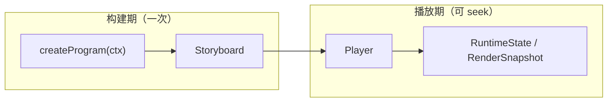

# Intermact API Reference

本文档列出 **v0.1（Phase-1）** 全部公共 API，页面内容由 [TypeDoc](https://typedoc.org/) 从 `packages/*/src` 的导出符号与 TSDoc 注释自动生成。阅读符号页之前，建议先了解下方**非 PCG** 架构——当前 API 面向「可交互 Manim 式 2D 叙事 + 调参」，不包含 Phase-3 的程序化生成（PCG）层。

> 完整契约与修订记录见仓库 [`dev-docs/design.md`](https://github.com/intermact/intermact/blob/main/dev-docs/design.md)。概念性教程见 [指南 · 架构概览](/guide/architecture)。

## 愿景与 API 边界

| 阶段 | 版本 | 主题 | 与本文档关系 |
| --- | --- | --- | --- |
| **Phase-1** | v0.1 | 可交互 Manim 替代品：2D 图元、可 seek 时间线、坐标轴、响应式调参 | **当前 API 范围** |
| Phase-2 | v0.2 | 数理工具箱：Scale、LaTeX、Morph matching、交互拾取 | 后续增量发布 |
| Phase-3 | v1.0 | PCG 演示系统：场/生成器/L-system、3D 全量、导出/嵌入 | **不在 v0.1 API 中** |

下文仅描述 Phase-1 已落地的结构；PCG（`design.md §6`）、序列化导出（`§17`）、插件（`§18`）等留待后续里程碑。

## 核心执行模型：可 seek 时间线

Intermact 采用**保留模（retained-mode）时间线**（`design.md §3.2`）：



| 阶段 | 职责 | 关键 API |
| --- | --- | --- |
| 构建期 | 注册对象；`scene.play` 向 Storyboard **追加**轨道 | [`createProgram`](/reference/@intermact/core/functions/createProgram), [`buildProgram`](/reference/@intermact/core/functions/buildProgram), [`Scene2D`](/reference/@intermact/core/classes/Scene2D) |
| 播放期 | `seek` / `update` 纯函数求值；确定性快照 | [`Player`](/reference/@intermact/core/classes/Player), [`Track`](/reference/@intermact/core/interfaces/Track), [`RenderSnapshot`](/reference/@intermact/core/interfaces/RenderSnapshot) |

`await scene.play(...)` 是构建期语法糖，逻辑时钟瞬间推进，不消耗墙钟时间。

## 对象三层：定义 · 实例 · 运行时态

```text
IMObject2D（不可变定义：几何 + trait）
    └── scene.register(...) → RegisteredObject2D（动画句柄：create / moveTo / tween …）
            └── Track 求值 → RuntimeState2D（位置、reveal、opacity、geometryOverride …）
```

- **定义层**：[`IMObject2D`](/reference/@intermact/core/interfaces/IMObject2D) + trait（[`stroke`](/reference/@intermact/core/interfaces/StrokeTrait) / [`fill`](/reference/@intermact/core/interfaces/FillTrait) / [`morphable`](/reference/@intermact/core/interfaces/MorphableTrait)）；图元工厂如 [`circle`](/reference/@intermact/core/functions/circle)、[`polygon`](/reference/@intermact/core/functions/polygon)。
- **实例层**：[`RegisteredObject2D`](/reference/@intermact/core/classes/RegisteredObject2D)——动画方法返回 [`Animation`](/reference/@intermact/core/interfaces/Animation) 数据，在 `play` 时编译。
- **运行时层**：[`RuntimeState2D`](/reference/@intermact/core/interfaces/RuntimeState2D) + [`applyPatch2D`](/reference/@intermact/core/functions/applyPatch2D)；渲染器消费 [`RenderSnapshot`](/reference/@intermact/core/interfaces/RenderSnapshot)。

## Scene · Camera · Canvas 解耦

与 Manim 不同，场景、相机、画布分层（`design.md §9–10`）：

| 层 | v0.1 角色 | 关键 API |
| --- | --- | --- |
| **Scene2D** | 坐标域、对象注册、`getAxes`、编排 `play` | [`Scene2D`](/reference/@intermact/core/classes/Scene2D) |
| **Camera** | 正交相机描述，挂载到视口 | [`createCamera2D`](/reference/@intermact/core/functions/createCamera2D) |
| **Canvas** | React 入口：构建 program、R3F 画布、时间线叠层 | [`IntermactCanvas`](/reference/@intermact/react/functions/IntermactCanvas) |

坐标变换：[`CoordinateTransform2D`](/reference/@intermact/core/classes/CoordinateTransform2D)（abs/rel、极坐标）。轴对象通过 `Scene2D.getAxes` 注册，显隐走 [`RegisteredObject2D`](/reference/@intermact/core/classes/RegisteredObject2D) 标准动画（`fadeIn` / `create`）。

## 包分层与渲染管线

```text
@intermact/react
  └── @intermact/render-r3f     SceneView、computeFit
        └── @intermact/render-three   stroke/fill 几何、ThreeSceneView
              └── @intermact/core     禁止 React / three / DOM
```

| 包 | 职责 |
| --- | --- |
| [`@intermact/core`](/reference/@intermact/core/) | 模型、几何、时间线、响应式；可 Node 无头运行 |
| [`@intermact/render-three`](/reference/@intermact/render-three/) | `RenderSnapshot` → three.js 几何（stroke trim、earcut fill） |
| [`@intermact/render-r3f`](/reference/@intermact/render-r3f/) | R3F 内 diff 更新、相机 fit、HiDPI |
| [`@intermact/react`](/reference/@intermact/react/) | `IntermactCanvas`、`useSignal`、时间线控件 |

数据流：`Player.getSnapshot()` → [`ThreeSceneView`](/reference/@intermact/render-three/classes/ThreeSceneView) diff → R3F [`SceneView`](/reference/@intermact/render-r3f/functions/SceneView)。

## 动画与编排（非 PCG）

| 能力 | API 入口 |
| --- | --- |
| Create / Fade / Move / Tween | [`RegisteredObject2D`](/reference/@intermact/core/classes/RegisteredObject2D), [`compileSpec`](/reference/@intermact/core/functions/compileSpec) |
| 编排 | [`sequence`](/reference/@intermact/core/functions/sequence), [`parallel`](/reference/@intermact/core/functions/parallel), [`stagger`](/reference/@intermact/core/functions/stagger), [`wait`](/reference/@intermact/core/functions/wait) |
| Morph（v0.1 仅 arc-length） | [`morph`](/reference/@intermact/core/functions/morph) |
| 副作用（**不可 seek**） | [`call`](/reference/@intermact/core/functions/call) |

## 响应式层（交互态，非生成式）

对齐 Manim `ValueTracker` + `add_updater`（`design.md §8`），用于**参数驱动的几何重算**，不是 PCG 场/语法生成：

- [`signal`](/reference/@intermact/core/functions/signal) / [`computed`](/reference/@intermact/core/functions/computed)
- [`derived`](/reference/@intermact/core/functions/derived) + [`ReactiveEngine`](/reference/@intermact/core/classes/ReactiveEngine)
- [`tweenSignal`](/reference/@intermact/core/functions/tweenSignal)、[`bindSignal`](/reference/@intermact/core/functions/bindSignal)、[`useSignal`](/reference/@intermact/react/functions/useSignal)

每帧：`Player.prepareFrame` → `ReactiveEngine.flush` → 再生成 `RenderSnapshot`。

## 如何查阅符号

1. 从下方 **Packages** 进入各包索引页。
2. 侧边栏按 Classes / Interfaces / Functions 浏览。
3. 修改 API 文档请编辑源码 TSDoc，运行 `pnpm run gen:reference` 重新生成。

## Packages

<!-- PACKAGES -->
